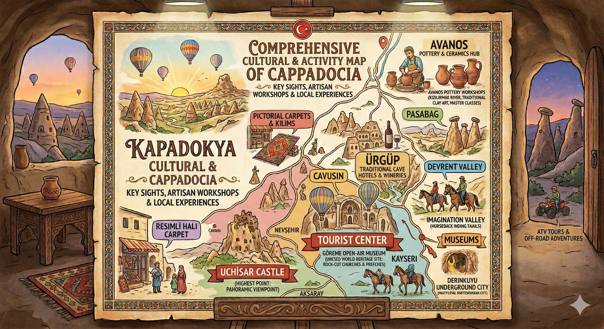

<!-- SECTION: THE CURATOR'S ROOTS -->
<h2 style="color: #8b0000;">🏠 My Cappadocia: The Triad of My Life</h2>

<table border="0" style="width:100%; background-color: #fdf5e6; border-radius: 15px; padding: 20px; border-collapse: collapse;">
  <tr>
    <!-- SOL SÜTUN: KİŞİSEL HİKAYE -->
    <td style="width: 50%; vertical-align: top; padding-right: 20px;">
      
Cappadocia is not just a destination for me; it is my timeline. As you can see on the map, my life follows the path of the <strong>Kızılırmak (Red River)</strong>.

      
      <ul style="line-height: 1.8;">
        <li><strong>Bayramhacı (The Source):</strong> My birthplace. Located by the dam, it's famous for its thermal springs. This is where I learned the value of nature and healing waters.</li>
        <li><strong>Avanos (The Mold):</strong> Where I grew up. The river's red clay shaped my childhood. It's the center of pottery and traditional Turkish handicrafts.</li>
        <li><strong>Göreme (The Heart):</strong> My current home and professional center. The pinnacle of rock-cut history where I now guide visitors as a local expert.</li>
      </ul>
      
<i>This map shows the 40km circle where I have spent my life, learning every valley and every knot of our culture.</i>

    </td>

        50 Years of Cappadocia Experience
    

---
---
layout: default
title: Global Cappadocia Guide - Polyglot Edition
---

<link rel="stylesheet" href="https://unpkg.com/leaflet@1.9.4/dist/leaflet.css" />

    <h1 id="interactive-map" style="color: #8b0000;">🏺 Cappadocia Master Polyglot Guide</h1>
    
<i>Insider Tips, VIP Contacts & Interactive Map</i>

<!-- ÇOK DİLLİ SEÇİCİ -->

    <button id="en-btn" class="lang-btn active" onclick="setLang('en')">🇺🇸 English</button>
    <button id="fr-btn" class="lang-btn" onclick="setLang('fr')">🇫🇷 Français</button>
    <button id="es-btn" class="lang-btn" onclick="setLang('es')">🇪🇸 Español</button>
    <button id="it-btn" class="lang-btn" onclick="setLang('it')">🇮🇹 Italiano</button>
    <button id="ru-btn" class="lang-btn" onclick="setLang('ru')">🇷🇺 Русский</button>
    <button id="zh-btn" class="lang-btn" onclick="setLang('zh')">🇨🇳 中文</button>
    <button id="ja-btn" class="lang-btn" onclick="setLang('ja')">🇯🇵 日本語</button>

    
✍️ A Personal Note

    

        Dear traveller, welcome to Cappadocia — one of the most extraordinary places on earth.  
        I have been walking these valleys, visiting these workshops, and sharing this land with visitors from every corner of the world for over <strong>50 years</strong>. As a teacher by profession and a passionate guide by heart, I have seen what makes a journey here truly memorable — and what leads people astray.  
        The places and people I have marked on this map are not random recommendations. They are the result of half a century of friendship, trust, and personal experience. When I point you to a carpet shop or a local expert, I do so as a friend who has sat at their table, drunk their tea, and watched them work with my own eyes.  
        <em>Explore with curiosity, shop with confidence, and let Cappadocia touch your heart the way it has touched mine.</em>
      Fatih Mehmet CANITEZ
    

    

    
👆 Scroll up to read more

    

        <button id="close-btn" onclick="closePanel()">✕</button>
        <h2 id="place-name"></h2>

        

            Expert Recommendation
            

        

        

            Description
            

        

        

            📱 Direct Contact
            

            <a id="wa-link" href="#" target="_blank" class="whatsapp-btn">💬 WhatsApp</a>
            <a id="ig-link" href="#" target="_blank" style="display:none; margin-left:8px; background:#E1306C; color:white; padding:8px 16px; border-radius:50px; text-decoration:none; font-weight:bold; font-size:13px;">📸 Instagram</a>
            <a id="maps-link" href="#" target="_blank" style="display:none; margin-left:8px; background:#4285F4; color:white; padding:8px 16px; border-radius:50px; text-decoration:none; font-weight:bold; font-size:13px;">📍 Google Maps</a>
        

        

            Insider Note
            

        

    

<!-- SECTION 2: THE BALLOON BIBLE -->
<h2 style="color: #8b0000;">🎈 The Hot Air Balloon Bible</h2>

The #1 question everyone asks. Let's be honest about how it works:

<table border="0" style="width:100%; background-color: #fffaf0; border: 1px dashed #8b0000; padding: 20px; border-radius: 10px;">
  <tr>
    <td>
      <h3>Why do prices change daily?</h3>
      
Think of it like a stock market. Prices depend on: 
      1. Seasonality (May-Oct is peak). 
      2. The "Backlog" (If flights were canceled for 3 days, the 4th day will be very expensive because everyone is waiting).

      
      <h3>The "Flag" System (Red/Yellow/Green)</h3>
      
The <strong>SHGM (Civil Aviation Authority)</strong> decides if we fly. 
      - 🟢 <b>Green:</b> We fly! 
      - 🟡 <b>Yellow:</b> Delay/Standby. 
      - 🔴 <b>Red:</b> Canceled. If it's red, no one flies. No exceptions for money or luck.

      
      <h3>Refunds?</h3>
      
If the flight is canceled by SHGM, you get a <b>100% full refund</b>. No cancellation fee. Period.

    </td>
  </tr>
</table>

<!-- SECTION 3: LOCAL CITIES & VILLAGES -->
<h2 style="color: #2e8b57;">🏘️ Towns You Must Visit</h2>

  

    <h4>🌟 Ürgüp</h4>
    
The "sophisticated" Cappadocia. Great for dining, high-end boutique hotels, and seeing the "Three Beauties" fairy chimneys.

  

  

    <h4>🎨 Avanos</h4>
    
My childhood home. Crossed by the Red River. You must try the pottery wheel and walk across the swinging bridge.

  

  

    <h4>⛪ Mustafapaşa</h4>
    
A hidden historical treasure. Formerly known as Sinasos, it holds the best examples of 19th-century Greek masonry.

  

<!-- SECTION: COMPREHENSIVE CULTURAL MAP -->

  <h2 style="color: #8b0000; margin-top: 0;">🗺️ Cappadocia: Cultural & Activity Roadmap</h2>
  

    This illustrative map highlights the essential "Cultural Nodes" of our region. From the pottery wheels of <b>Avanos</b> to the underground mysteries of <b>Derinkuyu</b>, every icon represents a thousand-year-old tradition.
  

  <!-- Haritaya tıklandığında tam boyutta yeni sekmede açılır -->
  

  

    🏺 <b>Artisan Workshops</b>
    ⛪ <b>Historical Sites</b>
    🐎 <b>Outdoor Adventure</b>
  

  
  

    <strong>💡 Insider Tip:</strong> Click on the map to enlarge and see the specific locations of carpet workshops and secret valleys.
  

<!-- SECTION 4: MUSEUMS & HIDDEN GEMS -->
<h2 style="color: #d4af37;">🏛️ Museums & Valleys</h2>
<ul>
  <li><strong>Göreme Open Air Museum:</strong> The mandatory stop for rock-cut churches and frescoes.</li>
  <li><strong>Zelve Open Air Museum:</strong> Much larger and more "wild" than Göreme. Great for hiking without huge crowds.</li>
  <li><strong>Bayramhacı (Curator's Choice):</strong> My birthplace. If you want a break from rocks, come here for the natural hot springs and thermal healing.</li>
  <li><strong>Ihlara Valley:</strong> A 14km hike through a lush canyon with 100+ churches.</li>
</ul>

<!-- SECTION 5: ADVENTURE -->
<h2 style="color: #e67e22;">🐎 Adventure Tours</h2>

If you have extra time, try these:

<table border="0" style="width:100%;">
  <tr>
    <td style="width: 50%; padding: 10px;">
      <b>Horseback Riding:</b> Cappadocia means "Land of Beautiful Horses." Sunset tours in the valleys are magic.
    </td>
    <td style="width: 50%; padding: 10px;">
      <b>ATV / Quad Safari:</b> Best for the "Sword Valley" and "Love Valley" trails if you like adrenaline and dust!
    </td>
  </tr>
</table>

  <h3>Need more local advice?</h3>
  
As a local active in Göreme, I'm here to help you understand the true culture behind the fairy chimneys.

  <a href="./me" style="color: #d4af37; font-weight: bold;">Learn more about me & my French courses</a>

  <a href="./">🏠 Return to Main Dashboard</a> | <a href="./en/handknotted">🧶 Technical Carpet Guide</a>

