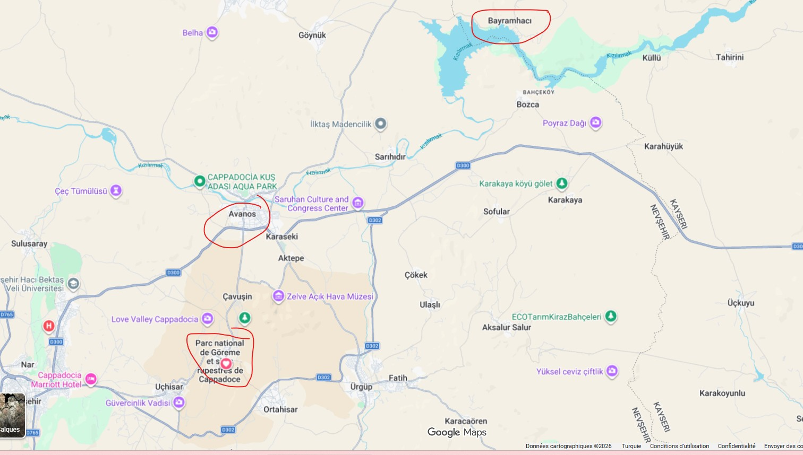

<!-- SECTION: THE CURATOR'S ROOTS -->
<h2 style="color: #8b0000;">🏠 My Cappadocia: The Triad of My Life</h2>

<table border="0" style="width:100%; background-color: #fdf5e6; border-radius: 15px; padding: 20px; border-collapse: collapse;">
  <tr>
    <!-- SOL SÜTUN: KİŞİSEL HİKAYE -->
    <td style="width: 50%; vertical-align: top; padding-right: 20px;">
      
Cappadocia is not just a destination for me; it is my timeline. As you can see on the map, my life follows the path of the <strong>Kızılırmak (Red River)</strong>.

      
      <ul style="line-height: 1.8;">
        <li><strong>Bayramhacı (The Source):</strong> My birthplace. Located by the dam, it's famous for its thermal springs. This is where I learned the value of nature and healing waters.</li>
        <li><strong>Avanos (The Mold):</strong> Where I grew up. The river's red clay shaped my childhood. It's the center of pottery and traditional Turkish handicrafts.</li>
        <li><strong>Göreme (The Heart):</strong> My current home and professional center. The pinnacle of rock-cut history where I now guide visitors as a local expert.</li>
      </ul>
      
<i>This map shows the 40km circle where I have spent my life, learning every valley and every knot of our culture.</i>

    </td>

    <!-- SAĞ SÜTUN: HARİTA GÖRSELİ -->
    <td style="width: 50%; text-align: center; vertical-align: middle;">
      
       
      <small style="color: #666;">(Click map to see full details of my region)</small>
    </td>
  </tr>
</table>

<!-- SECTION 1: LOGISTICS & DISTANCES -->
<h2 style="color: #1a2a6c;">✈️ Getting Here & Around</h2>

Göreme is the "center of the puzzle." Here is how you reach us and the distances you need to know:

<table border="1" style="width:100%; border-collapse: collapse; text-align: left; border-color: #eee;">
  <tr style="background-color: #1a2a6c; color: white;">
    <th style="padding: 10px;">Destination</th>
    <th style="padding: 10px;">Distance from Göreme</th>
    <th style="padding: 10px;">Travel Time / Tip</th>
  </tr>
  <tr>
    <td style="padding: 10px;"><strong>Nevşehir Airport (NAV)</strong></td>
    <td style="padding: 10px;">~40 km</td>
    <td style="padding: 10px;">45 min. Best for domestic flights from Istanbul.</td>
  </tr>
  <tr>
    <td style="padding: 10px;"><strong>Kayseri Airport (ASR)</strong></td>
    <td style="padding: 10px;">~75 km</td>
    <td style="padding: 10px;">1 hour. More international connections.</td>
  </tr>
  <tr>
    <td style="padding: 10px;"><strong>Ürgüp Center</strong></td>
    <td style="padding: 10px;">~10 km</td>
    <td style="padding: 10px;">12 min. The hub for nightlife and wine tasting.</td>
  </tr>
  <tr>
    <td style="padding: 10px;"><strong>Avanos (My Town)</strong></td>
    <td style="padding: 10px;">~12 km</td>
    <td style="padding: 10px;">15 min. Famous for pottery and the Red River.</td>
  </tr>
  <tr>
    <td style="padding: 10px;"><strong>Mustafapaşa (Sinasos)</strong></td>
    <td style="padding: 10px;">~15 km</td>
    <td style="padding: 10px;">20 min. An old Greek village with amazing architecture.</td>
  </tr>
</table>

<i>*Pro Tip: Always book an <b>Airport Shuttle</b> in advance. Taxis are very expensive for airport transfers.</i>

<!-- SECTION 2: THE BALLOON BIBLE -->
<h2 style="color: #8b0000;">🎈 The Hot Air Balloon Bible</h2>

The #1 question everyone asks. Let's be honest about how it works:

<table border="0" style="width:100%; background-color: #fffaf0; border: 1px dashed #8b0000; padding: 20px; border-radius: 10px;">
  <tr>
    <td>
      <h3>Why do prices change daily?</h3>
      
Think of it like a stock market. Prices depend on: 
      1. Seasonality (May-Oct is peak). 
      2. The "Backlog" (If flights were canceled for 3 days, the 4th day will be very expensive because everyone is waiting).

      
      <h3>The "Flag" System (Red/Yellow/Green)</h3>
      
The <strong>SHGM (Civil Aviation Authority)</strong> decides if we fly. 
      - 🟢 <b>Green:</b> We fly! 
      - 🟡 <b>Yellow:</b> Delay/Standby. 
      - 🔴 <b>Red:</b> Canceled. If it's red, no one flies. No exceptions for money or luck.

      
      <h3>Refunds?</h3>
      
If the flight is canceled by SHGM, you get a <b>100% full refund</b>. No cancellation fee. Period.

    </td>
  </tr>
</table>

<!-- SECTION 3: LOCAL CITIES & VILLAGES -->
<h2 style="color: #2e8b57;">🏘️ Towns You Must Visit</h2>

  

    <h4>🌟 Ürgüp</h4>
    
The "sophisticated" Cappadocia. Great for dining, high-end boutique hotels, and seeing the "Three Beauties" fairy chimneys.

  

  

    <h4>🎨 Avanos</h4>
    
My childhood home. Crossed by the Red River. You must try the pottery wheel and walk across the swinging bridge.

  

  

    <h4>⛪ Mustafapaşa</h4>
    
A hidden historical treasure. Formerly known as Sinasos, it holds the best examples of 19th-century Greek masonry.

  

<!-- SECTION: COMPREHENSIVE CULTURAL MAP -->

  <h2 style="color: #8b0000; margin-top: 0;">🗺️ Cappadocia: Cultural & Activity Roadmap</h2>
  

    This illustrative map highlights the essential "Cultural Nodes" of our region. From the pottery wheels of <b>Avanos</b> to the underground mysteries of <b>Derinkuyu</b>, every icon represents a thousand-year-old tradition.
  

  <!-- Haritaya tıklandığında tam boyutta yeni sekmede açılır -->
  

  

    🏺 <b>Artisan Workshops</b>
    ⛪ <b>Historical Sites</b>
    🐎 <b>Outdoor Adventure</b>
  

  
  

    <strong>💡 Insider Tip:</strong> Click on the map to enlarge and see the specific locations of carpet workshops and secret valleys.
  

<!-- SECTION 4: MUSEUMS & HIDDEN GEMS -->
<h2 style="color: #d4af37;">🏛️ Museums & Valleys</h2>
<ul>
  <li><strong>Göreme Open Air Museum:</strong> The mandatory stop for rock-cut churches and frescoes.</li>
  <li><strong>Zelve Open Air Museum:</strong> Much larger and more "wild" than Göreme. Great for hiking without huge crowds.</li>
  <li><strong>Bayramhacı (Curator's Choice):</strong> My birthplace. If you want a break from rocks, come here for the natural hot springs and thermal healing.</li>
  <li><strong>Ihlara Valley:</strong> A 14km hike through a lush canyon with 100+ churches.</li>
</ul>

<!-- SECTION 5: ADVENTURE -->
<h2 style="color: #e67e22;">🐎 Adventure Tours</h2>

If you have extra time, try these:

<table border="0" style="width:100%;">
  <tr>
    <td style="width: 50%; padding: 10px;">
      <b>Horseback Riding:</b> Cappadocia means "Land of Beautiful Horses." Sunset tours in the valleys are magic.
    </td>
    <td style="width: 50%; padding: 10px;">
      <b>ATV / Quad Safari:</b> Best for the "Sword Valley" and "Love Valley" trails if you like adrenaline and dust!
    </td>
  </tr>
</table>

  <h3>Need more local advice?</h3>
  
As a local active in Göreme, I'm here to help you understand the true culture behind the fairy chimneys.

  <a href="./me" style="color: #d4af37; font-weight: bold;">Learn more about me & my French courses</a>

  <a href="./">🏠 Return to Main Dashboard</a> | <a href="./en/handknotted">🧶 Technical Carpet Guide</a>

