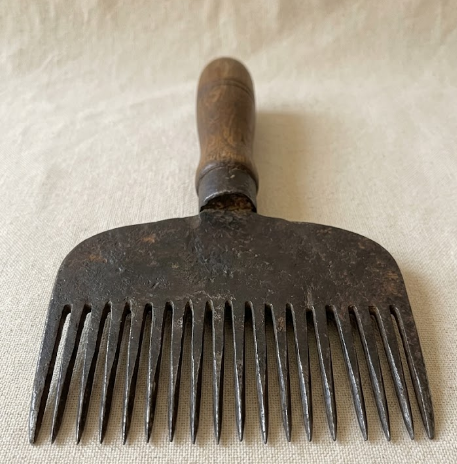

<table border="0" width="100%">
  <tr>
    <td valign="middle">
      <h1>🧶 Carpet & Kilim Guide</h1>
      
<b>Expert Curation by Fatih Mehmet Canıtez</b>

    </td>
    <td align="right" valign="middle">
      
       
      <small><b>Fatih Canıtez</b> Expert Curator</small>
    </td>
  </tr>
</table>

  <!-- ANA GÖRSEL: KİRKİT -->
  
    

  <!-- ANINDA WHATSAPP İLETİŞİM -->
  
   
  <i>"Ancient tools, eternal art. Message me for expert guidance."</i>

---

## 🏛️ 1. The Art of Carpets (Halı)
*Carpets are knotted masterpieces, built for luxury and a lifetime of use.*

#### 🏺 [The Pazyryk Carpet: Our Story Starts Here](./en/#pazyryk)
> [→ Read Pazyryk History & Analysis](./en/#pazyryk)

#### 🏆 Famous Rug Types
> [→ Explore Hereke, Usak & Bergama Rugs](./en/#types)

---

## 🎨 2. The Poetry of Kilims (Düz Dokuma)
*Kilims are flat-woven stories, where every geometric shape is a coded message.*

*   📖 **[Introduction to Kilim Art](./en/kilim)**
*   🌸 **[Detailed Guide: Cicim (Jijim) Technique](./en/cicim)**
*   🌀 **[Detailed Guide: Sumak (Soumak) Technique](./en/sumak)**
*   🏗️ **[Detailed Guide: Zili (Sili) Technique](./en/zili)**

---

## 👨‍🏫 3. About the Expert & Academy
Learn more about my background as a polyglot educator and rug curator.
> [👉 View My Profile & Language Lessons](./me)

---

### 🛠️ Technical Insights (Quick View)

  
<b>🌿 The Art of Natural Dyeing</b>

   
  

  
<b>🪢 Knot Comparison (Turkish vs Persian)</b>

   
  

---

<i>Created with ❤️ for the World of Weaving</i>

