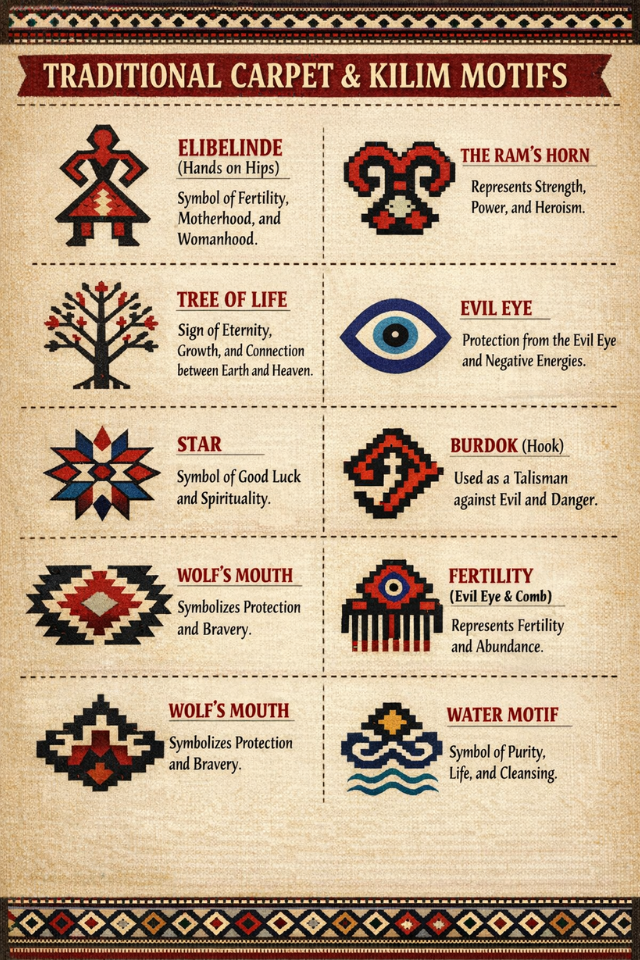

# 🧶 Global Carpet & Kilim Guide: Cappadocia Edition

<!-- 1. ÜST BÖLÜM: İSİM VE FOTOĞRAF YAN YANA -->
<table border="0" width="100%">
  <tr>
    <td valign="middle">
      <h1>Expert Curation</h1>
      
<b>Fatih Mehmet Canıtez</b> 
      French Language Educator & Polyglot 
      Expert in Traditional Anatolian Weaving

    </td>
    <td align="right" valign="middle">
      
    </td>
  </tr>
</table>

<!-- 2. ANA VİTRİN: KAPADOKYA VE WHATSAPP -->

  
    
  
  
<i>"Ancient tools, eternal art. A rug is a map of the soul."</i>

---

<!-- 3. HALI BÖLÜMÜ (SOLDA KÜÇÜK KİRKİT) -->
<table border="0">
  <tr>
    <td width="100" valign="top">
      
    </td>
    <td valign="top" style="padding-left: 15px;">
      <h3>🏛️ 1. The Art of Carpets (Halı)</h3>
      
<i>Discover the 2500-year history of knotted masterpieces.</i>

      <ul>
        <li>🏺 <b><a href="./en/#pazyryk">The Pazyryk Carpet: Our Story Starts Here</a></b></li>
        <li>🏆 <a href="./en/#types">Famous Rug Types (Hereke, Usak, Bergama)</a></li>
      </ul>
    </td>
  </tr>
</table>
🏺

<!-- 4. KİLİM BÖLÜMÜ (SOLDA KÜÇÜK MOTİFLER) -->
<table border="0">
  <tr>
    <td width="100" valign="top">
      
    </td>
    <td valign="top" style="padding-left: 15px;">
      <h3>🎨 2. The Poetry of Kilims (Düz Dokuma)</h3>
      
<i>Flat-woven stories told through 9,000 years of geometric symbols.</i>

      <ul>
        <li>📖 <b><a href="./en/kilim">Full Kilim Guide: History & Symbols</a></b></li>
        <li>🌸 <a href="./en/cicim">Detailed Guide: Cicim (Jijim) Technique</a></li>
        <li>🌀 <a href="./en/sumak">Detailed Guide: Sumak (Soumak) Technique</a></li>
        <li>🏗️ <a href="./en/zili">Detailed Guide: Zili (Sili) Technique</a></li>
      </ul>
    </td>
  </tr>
</table>

---

<!-- 5. TEKNİK DETAYLAR (AÇILIR PANELLER) -->
## 🛠️ Technical Insights: Behind the Loom

  
<b>🌿 The Art of Natural Dyeing (Kök Boya)</b>

   
  

    
    
<i>Organic colors from Madder Root, Indigo, and Saffron.</i>

  

  
<b>🪢 Knot Comparison (Turkish vs Persian)</b>

   
  

    
    
<i>The science of the Ghiordes Double Knot.</i>

  

  
<b>🐑 The 12-Step Production Journey</b>

   
  

    
  

---

<!-- 6. UZMAN PROFİLİ VE DERSLER LİNKİ -->
### 👨‍🏫 Meet the Expert & Academy
Learn more about my background as a polyglot educator and rug curator. 
> [👉 View My Full Profile & Language Lessons (me.md)](./me)

---

<!-- 7. ULUSLARARASI BÖLÜMLER -->
### 🌍 International Sections (Coming Soon)
| 🇫🇷 French | 🇮🇹 Italian | 🇪🇸 Spanish |
| :--- | :--- | :--- |
|  |  |  |

---

<i>Maintained with ❤️ by @fmemo75-prog</i>

