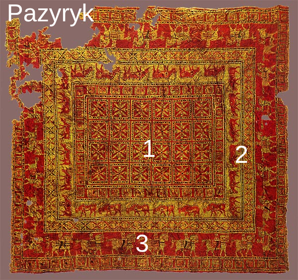

## 🏛️ Ancient Origins: The Pazyryk Carpet

### ❄️ Frozen in Time: Why This Rug Changed History
The story of every knotted rug in this collection begins in 1949, in the frozen Altai Mountains of Siberia. The **Pazyryk Carpet** is the world’s oldest known knotted rug, dating back to the **5th Century BC**.

**The Pazyryk Importance:**
*   **The Miracle of Ice:** Trapped in a frozen tomb for **2,500 years**, the rug was preserved in solid ice. This is why we can still see its vibrant colors and intricate details today.
*   **The Golden Knot:** It features the **Ghiordes (Turkish) Double Knot**. This proves that this sophisticated weaving technique was already a perfected art form among ancient Turkic tribes millennia ago.
*   **A Royal Message:** The 28 horsemen and the grazing stags on the borders show that rugs were never just floor coverings; they were status symbols and high-tech art for ancient kings.

---

### 🔍 Deep Dive: Visual Map Analysis
| No | Visual Zone | Element | Symbolism |
| :-- | :--- | :--- | :--- |
| **1** | Center | 24 Rosettes | Eternal life and the solar cycle. |
| **2** | Inner Border | Procession of Stags | The spiritual connection to nature. |
| **3** | Outer Border | The Horsemen | Military power and high social status. |

---
