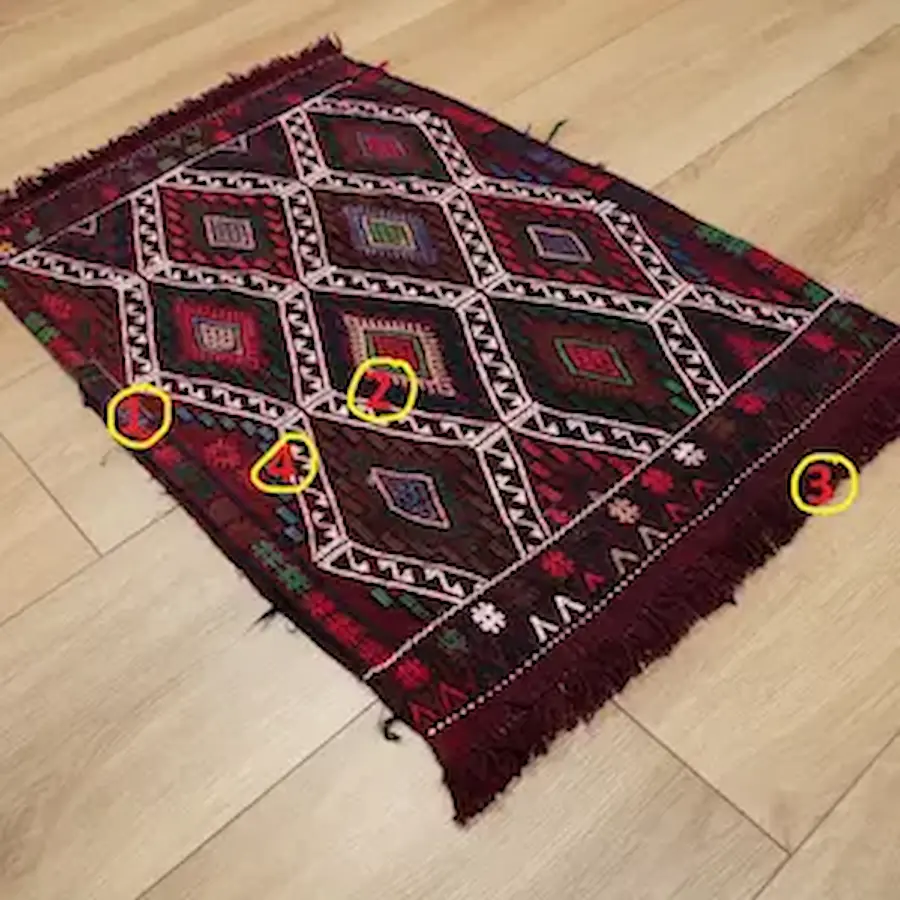
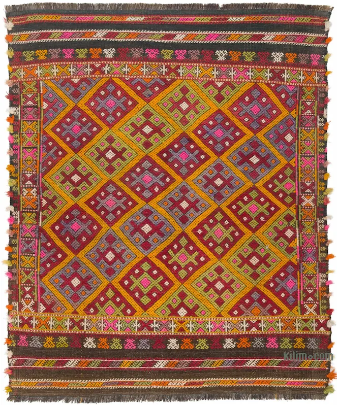

# 🌸 Cicim (Jijim) The Art of Woven Embroidery  

Cicim is one of the most decorative and labor-intensive flat-weave techniques in Anatolia. Often mistaken for embroidery, it is actually a specialized weaving method where extra colorful threads are added during the weaving process.

---

## 🎨 What Makes Cicim Special
Unlike a standard Kilim, where the surface is smooth, a Cicim rug has a raised pattern. The weaver creates the background first and then brocades the motifs on top using a needle-like technique on the loom.

### Key Characteristics
   3D Texture The patterns feel slightly elevated from the base.
   Intricate Details Allows for much finer and more delicate motifs than a regular Kilim.
   Versatility Traditionally used for bridal dowries (çeyiz), wall hangings, and decorative floor covers.

---

## 📸 Visual Gallery (Examples)

### 1. The Classic Anatolian Cicim

Example of a vintage Cicim with geometric floral motifs.

### 2. Geometric Precision

(Note You can upload your own close-up photos of Cicim textures here)
# 🌸 Cicim (Jijim) Gallery: The Language of Geometry

Cicim weaving is like painting with a needle on a loom. Every line and shape is a "coded message" from the weaver. Let’s analyze these two masterpieces from our collection.

---

## 🍷 Example 1: The Nomadic Mystery (Deep Burgundy)

This piece represents the classic tribal Anatolian style. Its dark, rich tones and structured layout speak of tradition and protection.

### 🔍 Key Motifs & Symbols:
*   **The Diamond Lattice (Baklava):** The white lines forming diamonds represent **unity and family**. It acts as a "fence" protecting the symbols inside.
*   **The Burdock (Pıtrak):** Inside the diamonds, you see colorful star-like shapes. In Anatolia, the Burdock is a plant that sticks to everything; thus, it is believed to **"stick to evil eyes"** and keep them away from the home.
*   **Color Palette:** The deep madder red (*Kök Boya*) symbolizes fire and life, while the indigo blue represents the sky.

---

## ☀️ Example 2: The Anatolian Sun (Vibrant Geometry)

This Cicim is a celebration of life and joy. Its bright yellow foundation and repeating geometric blocks make it a perfect example of high-detail brocading.

### 🔍 Key Motifs & Symbols:
*   **The Hooked Diamond (Kancalı):** The large central motifs are "hooked." Hooks are used in weaving to **"catch" good luck and abundance**. 
*   **Wolf Tracks (Kurt İzi):** Look at the jagged, repeating shapes on the borders. Nomadic tribes used this to represent **bravery and protection** for their flocks.
*   **The Running Water (Akarsu):** The thin wavy lines represent the flow of life and **purity**.

---

## 📊 Quick Comparison for Collectors

| Feature | The Nomadic Mystery | The Anatolian Sun |
| :--- | :--- | :--- |
| **Aura** | Formal, traditional, protective | Modern, energetic, cheerful |
| **Material** | 100% Hand-spun Wool | 100% Hand-spun Wool |
| **Dyes** | Natural Indigo & Madder | Natural Saffron & Root Dyes |
| **Best For** | Classic interiors, study rooms | Modern sunlit apartments |

---

### 🛡️ Why it is a Masterpiece?
You can feel the texture of the motifs sitting "on top" of the flat-weave base—this 3D effect is the soul of an authentic, hand-woven Cicim. Unlike machine copies, these pieces have a "heartbeat."

[⬅️ Back to English Guide](./README.md) | [🏠 Global Home Page](../README.md)
---

## 🔍 How to Identify a Real Cicim
1.  Look at the Back If you see loose threads or a messier version of the pattern on the back, it is a sign of authentic hand-brocading.
2.  Feel the Pattern Run your hand over the motif. You should feel it sitting on top of the flat base.
3.  Color Depth Genuine Cicims use many different colors in a small area, which is very difficult to do in machine weaving.

---
[⬅️ Back to English Guide](.README.md)  [🏠 Global Home Page](..README.md)