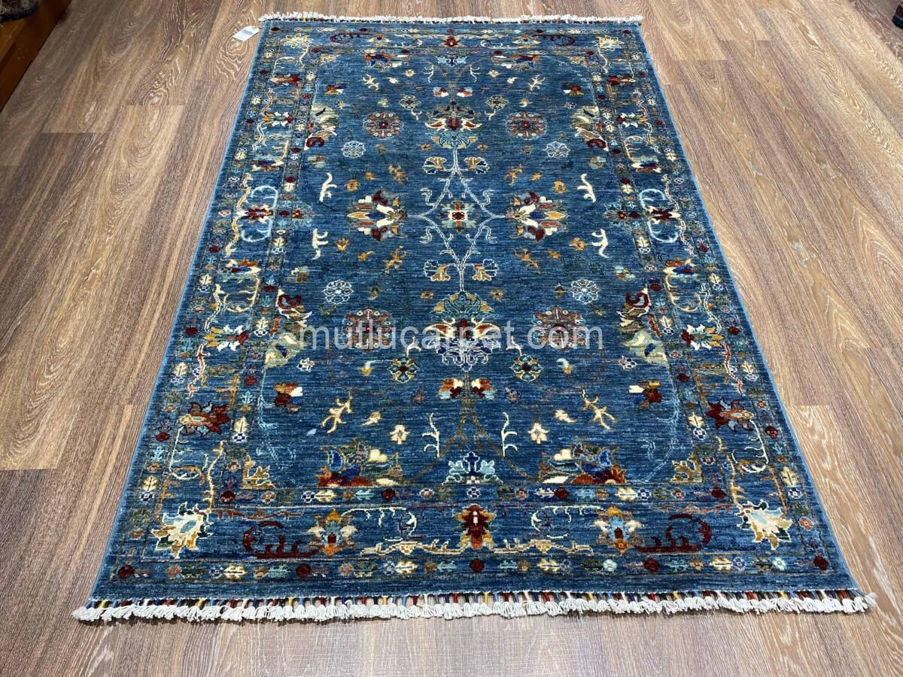
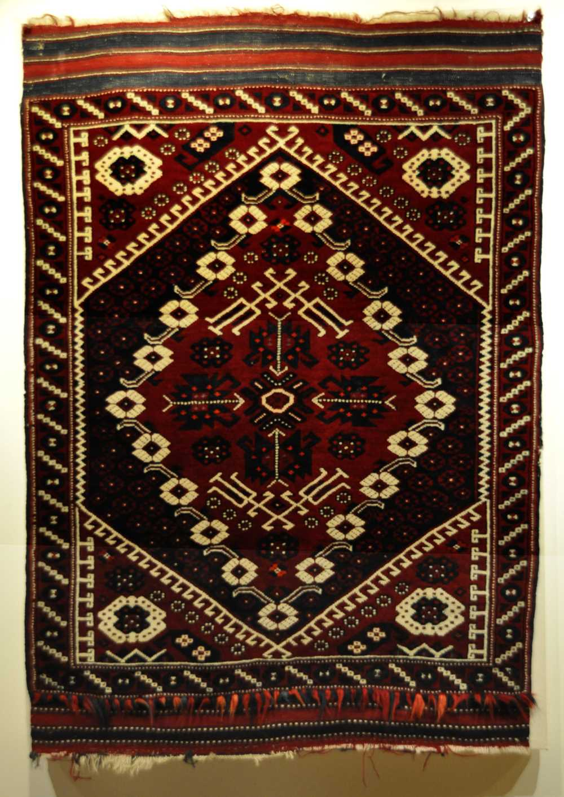

# Masterpieces of Anatolia: Motif & Design Analysis

A hand-knotted carpet tells a story through its symbols. Below is a technical and symbolic analysis of the Uşak and Bergama traditions.

<!-- SECTION: UŞAK (OUSHAK) -->
<table border="0" style="width:100%; margin-bottom: 40px; background-color: #fcfcfc; padding: 15px; border-radius: 10px;">
  <tr>
    <td style="width: 45%; text-align: center; vertical-align: middle;">
      
       <small>(Click to enlarge Uşak image)</small>
    </td>
    <td style="width: 55%; padding-left: 25px; vertical-align: top;">
      <h2 style="color: #b22222; margin-top: 0;">1. The Uşak (Oushak) Tradition</h2>
      
Uşak carpets are the "aristocrats" of the Turkish carpet world. The example shown features a rare indigo field with sophisticated floral arrangements.

      
      <h3>Key Motifs in this Piece:</h3>
      <ul>
        <li><strong>Palmettes & Lotus:</strong> These large floral symbols represent immortality and the "Gardens of Paradise."</li>
        <li><strong>The Star (Yıldız):</strong> Often found in the center, symbolizing the universe and spiritual light.</li>
        <li><strong>Indigo Palette:</strong> The deep blue represents nobility and was historically a sign of high status.</li>
      </ul>
      
<i>Technical Note: Large-scale patterns like these require high-quality wool to maintain the soft, decorative look.</i>

    </td>
  </tr>
</table>

<!-- SECTION: BERGAMA -->
<table border="0" style="width:100%; margin-bottom: 40px; background-color: #f9fdf9; padding: 15px; border-radius: 10px;">
  <tr>
    <td style="width: 55%; padding-right: 25px; vertical-align: top;">
      <h2 style="color: #2e8b57; margin-top: 0;">2. The Bergama Tradition</h2>
      
Bergama carpets are the descendants of the ancient Pergamon culture, deeply rooted in nomadic (Yörük) traditions.

      
      <h3>Key Motifs in this Piece:</h3>
      <ul>
        <li><strong>Geometric Medallions:</strong> Unlike the rounded Uşak forms, Bergama uses octagons and squares representing protection and tribal stamps (Tamga).</li>
        <li><strong>Elibelinde (Hands-on-Hips):</strong> A sacred symbol of femininity, fertility, and the mother goddess.</li>
        <li><strong>The Scorpion (Akrep):</strong> Used on the borders to protect the owner from external harm.</li>
      </ul>
      
<i>Technical Note: Bergama carpets are famous for their long-pile wool and "Wool on Wool" structure.</i>

    </td>
    <td style="width: 45%; text-align: center; vertical-align: middle;">
      
       <small>(Click to enlarge Bergama image)</small>
    </td>
  </tr>
</table>

  <strong>Explore further:</strong> 
  <a href="./materials">View Material Classification</a> | <a href="./">Return to Dashboard</a>

<!-- SECTION: KAYSERİ (BÜNYAN & YAHYALI) -->
<table border="0" style="width:100%; margin-bottom: 40px; background-color: #f0f7ff; padding: 20px; border-radius: 15px; border: 1px solid #d1e3f8;">
  <tr>
    <td colspan="2">
      <h2 style="color: #1a2a6c; margin-top: 0;">3. Kayseri: The Dual Tradition of Fine Weaving</h2>
      
Kayseri is one of Turkey’s most versatile weaving centers, famous for producing both sturdy wool-on-cotton village rugs and world-class silk masterpieces.

    </td>
  </tr>
  <tr>
    <td style="width: 50%; text-align: center; vertical-align: top; padding: 10px;">
      <a href="{{ site.baseurl }}/images/hali-kayseri-1.jpg" target="_blank">
         <table border="0" style="width:100%; background-color: #fdf5e6; padding: 15px; border-radius: 10px; border-left: 5px solid #8b4513;">
  <tr>
    <td style="width: 40%;">
      
    </td>
    <td style="width: 60%; padding-left: 20px; vertical-align: top;">
      <h3 style="color: #8b4513; margin-top: 0;">Symbolism of the Yahyalı Medallion</h3>
      <ul>
        <li><strong>Triple Medallions:</strong> Represents the protection of the family unit across generations.</li>
        <li><strong>Koçboynuzu (Ram’s Horn):</strong> The jagged hooks on the medallion edges symbolize strength and abundance.</li>
        <li><strong>Geometric Flowers:</strong> The small squares inside the diamonds are stylized blossoms, reflecting the local flora of the Erciyes foothills.</li>
        <li><strong>Indigo & Madder:</strong> The contrast between deep navy and madder red is a signature of high-quality Kayseri village weavings.</li>
      </ul>
    </td>
  </tr>
</table>
      </a>
      
<strong>The Geometric Style (Yahyalı):</strong> Characterized by bold central medallions and geometric borders using rich madder red and indigo blue.

    </td>
    <td style="width: 50%; text-align: center; vertical-align: top; padding: 10px;">
      
      
<strong>The Floral Style (Bünyan):</strong> Highly sophisticated "Palace" designs with intricate floral scrolls and fine knot density, often in soft, elegant color palettes.

    </td>
  </tr>
</table>
<!-- SECTION: MİLAS -->
<table border="0" style="width:100%; margin-bottom: 40px; background-color: #fff9e6; padding: 15px; border-radius: 10px; border: 1px solid #eee8aa;">
  <tr>
    <td style="width: 55%; padding-right: 25px; vertical-align: top;">
      <h2 style="color: #8b4513; margin-top: 0;">4. The Milas Tradition</h2>
      
Originating from the Aegean coast, Milas carpets are world-renowned for their unique color palette and distinct geometric-floral hybrid style.

      
      <h3>Key Motifs in this Tradition:</h3>
      <ul>
        <li><strong>Tobacco Yellow (Tütün Sarısı):</strong> The signature color of Milas, derived from local plant dyes, representing the sun-drenched Aegean landscape.</li>
        <li><strong>The 'Ada' (Island) Motif:</strong> A stylized rectangular medallion that symbolizes the stability of home and rootedness.</li>
        <li><strong>Carnations (Karanfil):</strong> Stylized floral borders representing the gardens of paradise and spiritual renewal.</li>
        <li><strong>Tree of Life:</strong> Often found in simpler forms, symbolizing the connection between earth and heaven.</li>
      </ul>
      
<i>Technical Note: Milas carpets are traditionally "Wool on Wool" with a distinctive soft, slightly loose knotting style that gives them a characteristic velvet-like handle.</i>

    </td>
    <td style="width: 45%; text-align: center; vertical-align: middle;">
      
       <small>(Click to enlarge Milas image)</small>
    </td>
  </tr>
</table>

<!DOCTYPE html>
<html lang="en">
<head>

</head>
<body>

    
    

        <h2>Döşemealtı Hand-Knotted Carpets</h2>
    

    <!-- General Info Section -->
    

        <h3>General Information</h3>
        
<strong>Döşemealtı carpets</strong> are iconic nomadic weavings from the Antalya region of Southern Turkey, traditionally crafted by the <strong>Teke Yörüks</strong>. Known for their high-quality wool-on-wool construction and distinctive deep red and indigo blue tones, these carpets represent a centuries-old nomadic heritage.

        <ul class="spec-list">
            <li><strong>Origin:</strong> Antalya / Döşemealtı, Turkey</li>
            <li><strong>Knot Type:</strong> Symmetrical (Turkish) Knot</li>
            <li><strong>Material:</strong> 100% Hand-spun Wool</li>
            <li><strong>Dyes:</strong> Natural Vegetable Dyes</li>
        </ul>
    

    

    <!-- Item 01 Section -->
    

        

            <h3>Item 01: Döşemealtı Classic Area Rug</h3>
            <ul class="spec-list">
                <li><strong>Design:</strong> "Güllü" (Cruciform) Pattern</li>
                <li><strong>Central Field:</strong> Deep Indigo Blue with 3 primary medallions.</li>
                <li><strong>Border:</strong> Geometric "Crenelated" inner guard with star-patterned main border.</li>
                <li><strong>Description:</strong> A quintessential nomadic piece featuring strong geometric definition. The blue field offers a striking contrast to the terracotta borders.</li>
                <li><strong>Usage:</strong> Ideal for living spaces and traditional decor settings.</li>
            </ul>
        

    

    <!-- Item 02 Section -->
    

        

            <h3>Item 02: Döşemealtı Geometric Runner (Yolluk)</h3>
            <ul class="spec-list">
                <li><strong>Design:</strong> Repeating Medallion / Vertical Axis</li>
                <li><strong>Central Field:</strong> Rich Madder Red / Burgundy.</li>
                <li><strong>Border:</strong> Classic Ivory "Yörük" border with floral motifs.</li>
                <li><strong>Description:</strong> An elegant elongated runner showcasing vertical symmetry. Its ivory borders frame the deep red field perfectly, highlighting the fine knotting.</li>
                <li><strong>Usage:</strong> Perfect for hallways, corridors, or narrow entryways.</li>
            </ul>
        

<<<<<<< HEAD
=======
        

          
Example 1

          <h3 class="card-title">The Geometric Field</h3>
          

            A classic Döşemealtı field composition built entirely from <strong>geometric repeat units</strong>.
            The bold central field is enclosed by a triple-border system — the characteristic framing
            device of the Taurus village tradition.
          

          <ul class="motif-list">
            <li>
              

              

                Central Medallion (Madalyon)
                The stepped octagonal medallion is the compositional anchor of the piece. Its sharp angles — characteristic of wool-on-wool weaving — represent <strong>tribal identity and territorial belonging</strong>.
              

            </li>
            <li>
              

              

                Running Hook Border (Çengel)
                The inner border carries a continuous chain of S-shaped hooks — an ancient apotropaic symbol used to <strong>protect the household from the evil eye</strong>.
              

            </li>
            <li>
              

              

                Madder Red Field
                The dominant field colour is obtained from the <em>Rubia tinctorum</em> root (madder). In Döşemealtı tradition, deep madder red signals <strong>strength and vitality</strong> and is the most prized dye colour.
              

            </li>
            <li>
              

              

                Corner Pieces (Köşebent)
                Quarter-medallion forms fill the field corners, completing the visual symmetry. These also carry small <strong>stylised flower or diamond</strong> sub-motifs specific to Döşemealtı village identity.
              

            </li>
          </ul>

          

            <strong>Technical note:</strong> Medium pile height with hand-spun local wool gives this piece
            the characteristic slightly irregular surface that distinguishes authentic village weaving from
            workshop production. Asymmetric selvedge width is common and accepted in the tradition.
          

        

      

      <!-- ── CARD 2 ── -->
      

        

          
          Click to enlarge
        

        

          
Example 2

          <h3 class="card-title">The Prayer Format</h3>
          

            The <em>seccade</em> (prayer rug) format requires the weaver to place a <strong>mihrab
            arch</strong> — a stylised niche pointing toward Mecca — as the central compositional element.
            In Döşemealtı hands, the arch takes on boldly angular, geometric character.
          

          <ul class="motif-list">
            <li>
              

              

                Mihrab Arch (Mihrap)
                The stepped niche arch dominates the field. Unlike the rounded arches of Ottoman court carpets, the Döşemealtı mihrab is <strong>angular and jagged</strong> — a direct result of the coarser wool-on-wool knotting grid.
              

            </li>
            <li>
              

              

                Lamp (Kandil) Motif
                A pendant hanging from the apex of the arch represents the <strong>divine light of the mosque lamp</strong>. This is one of the most consistent motifs across all Anatolian prayer rug traditions.
              

            </li>
            <li>
              

              

                Tree of Life (Hayat Ağacı)
                Stylised trees or branching forms inside the niche field represent the <strong>connection between earth and paradise</strong>. In Döşemealtı prayer rugs these are geometricised into stacked diamond or lozenge forms.
              

            </li>
            <li>
              

              

                Indigo Spandrels
                The triangular field areas flanking the arch are filled with <strong>indigo blue</strong> — derived from <em>Indigofera tinctoria</em>. Indigo in this context represents <strong>sky, divinity, and spiritual aspiration</strong>.
              

            </li>
          </ul>

          

            <strong>Technical note:</strong> Prayer rugs typically have a lower knot count than field
            carpets, as the central niche requires large colour fields rather than fine detail. The
            Döşemealtı tradition uses the Turkish (symmetrical) knot exclusively — consistent with
            the wider Anatolian village weaving practice.
          

        

      

    
<!-- /.photo-cards -->
  
<!-- /.analysis-section -->

  <!-- ── TECHNIQUE DIAGRAM ── -->
  

    
Process

    <h2>How a Döşemealtı carpet <em>is made</em></h2>
    
The five-stage hand-knotting process — from loom setup to finishing.

    

      

        <button class="step-pill sp-active" onclick="goTo(0)">I · Loom</button>
        <button class="step-pill"           onclick="goTo(1)">II · Warp</button>
        <button class="step-pill"           onclick="goTo(2)">III · Knot</button>
        <button class="step-pill"           onclick="goTo(3)">IV · Weft</button>
        <button class="step-pill"           onclick="goTo(4)">V · Finish</button>
      

      

        <svg id="diag-svg" viewBox="0 0 560 315" xmlns="http://www.w3.org/2000/svg">
          <defs>
            <marker id="arr" viewBox="0 0 10 10" refX="8" refY="5" markerWidth="5" markerHeight="5" orient="auto-start-reverse">
              <path d="M2 1L8 5L2 9" fill="none" stroke="context-stroke" stroke-width="1.8" stroke-linecap="round" stroke-linejoin="round"/>
            </marker>
            <pattern id="bgD" width="20" height="20" patternUnits="userSpaceOnUse">
              <circle cx="1" cy="1" r=".5" fill="#d8d4cb" opacity=".4"/>
            </pattern>
          </defs>
          <rect width="560" height="315" fill="url(#bgD)"/>

          <!-- Warp threads (always visible) -->
          <g id="d-warps">
            <rect x="60"  y="20" width="9" height="275" rx="4.5" fill="#c8c4bc"/>
            <rect x="61"  y="20" width="2.5" height="275" rx="1.2" fill="rgba(255,255,255,.4)"/>
            <rect x="115" y="20" width="9" height="275" rx="4.5" fill="#c8c4bc"/>
            <rect x="116" y="20" width="2.5" height="275" rx="1.2" fill="rgba(255,255,255,.4)"/>
            <rect x="170" y="20" width="9" height="275" rx="4.5" fill="#c8c4bc"/>
            <rect x="171" y="20" width="2.5" height="275" rx="1.2" fill="rgba(255,255,255,.4)"/>
            <rect x="225" y="20" width="9" height="275" rx="4.5" fill="#c8c4bc"/>
            <rect x="226" y="20" width="2.5" height="275" rx="1.2" fill="rgba(255,255,255,.4)"/>
            <rect x="280" y="20" width="9" height="275" rx="4.5" fill="#c8c4bc"/>
            <rect x="281" y="20" width="2.5" height="275" rx="1.2" fill="rgba(255,255,255,.4)"/>
            <rect x="335" y="20" width="9" height="275" rx="4.5" fill="#c8c4bc"/>
            <rect x="336" y="20" width="2.5" height="275" rx="1.2" fill="rgba(255,255,255,.4)"/>
            <rect x="390" y="20" width="9" height="275" rx="4.5" fill="#c8c4bc"/>
            <rect x="391" y="20" width="2.5" height="275" rx="1.2" fill="rgba(255,255,255,.4)"/>
            <rect x="445" y="20" width="9" height="275" rx="4.5" fill="#c8c4bc"/>
            <rect x="446" y="20" width="2.5" height="275" rx="1.2" fill="rgba(255,255,255,.4)"/>
            <text x="64"  y="304" text-anchor="middle" font-family="Outfit,sans-serif" font-size="8" fill="#9a9590" letter-spacing=".3" font-weight="400">W1</text>
            <text x="449" y="304" text-anchor="middle" font-family="Outfit,sans-serif" font-size="8" fill="#9a9590" letter-spacing=".3" font-weight="400">W8</text>
          </g>

          <!-- Step 0: loom frame -->
          <g id="d0">
            <!-- top beam -->
            <rect x="40" y="15" width="430" height="12" rx="4" fill="#7c7970" opacity=".7"/>
            <!-- bottom beam -->
            <rect x="40" y="283" width="430" height="12" rx="4" fill="#7c7970" opacity=".7"/>
            <!-- side uprights -->
            <rect x="30" y="12" width="12" height="286" rx="4" fill="#7c7970" opacity=".5"/>
            <rect x="468" y="12" width="12" height="286" rx="4" fill="#7c7970" opacity=".5"/>
            <!-- label -->
            <rect x="170" y="135" width="170" height="22" rx="2" fill="var(--bg)" stroke="var(--line2)" stroke-width=".7"/>
            <text x="255" y="149" text-anchor="middle" font-family="Outfit,sans-serif" font-size="8.5" font-weight="500" fill="var(--ink)" letter-spacing=".08em">VERTICAL LOOM (AYAKLI TEZGAH)</text>
          </g>

          <!-- Step 1: warps strung -->
          <g id="d1" style="opacity:0">
            <path class="anim-path" style="--len:300"
              d="M 40,32 L 480,32"
              fill="none" stroke="#5a3e2b" stroke-width="3" stroke-linecap="round" marker-end="url(#arr)"/>
            <rect x="155" y="45" width="210" height="20" rx="2" fill="var(--bg)" stroke="var(--line2)" stroke-width=".7"/>
            <text x="260" y="58" text-anchor="middle" font-family="Outfit,sans-serif" font-size="8" font-weight="500" fill="var(--ink)" letter-spacing=".07em">WARPS STRUNG VERTICALLY</text>
            <text x="260" y="84" text-anchor="middle" font-family="Outfit,sans-serif" font-size="8.5" font-weight="300" fill="#7c7970">hand-spun wool · under constant tension</text>
          </g>

          <!-- Step 2: Turkish knot on two warps -->
          <g id="d2" style="opacity:0">
            <!-- existing weft rows -->
            <rect x="40" y="200" width="430" height="9" rx="2" fill="#9a9590" opacity=".4"/>
            <rect x="40" y="215" width="430" height="9" rx="2" fill="#9a9590" opacity=".4"/>
            <!-- Turkish knot around W4+W5 -->
            <path class="anim-path" style="--len:300"
              d="M 225,180
                 Q 218,180 218,162 Q 218,144 230,144
                 Q 289,144 289,162 Q 289,180 280,180
                 Q 268,180 268,162 Q 268,144 280,144"
              fill="none" stroke="#5a3e2b" stroke-width="5" stroke-linecap="round"/>
            <!-- pile ends -->
            <path id="pile1" d="M 225,180 L 225,230" fill="none" stroke="#5a3e2b" stroke-width="4.5" stroke-linecap="round" opacity="0"/>
            <path id="pile2" d="M 289,180 L 289,230" fill="none" stroke="#5a3e2b" stroke-width="4.5" stroke-linecap="round" opacity="0"/>
            <!-- label -->
            <rect x="310" y="146" width="158" height="36" rx="2" fill="var(--bg)" stroke="var(--line2)" stroke-width=".7"/>
            <text x="389" y="160" text-anchor="middle" font-family="Outfit,sans-serif" font-size="8" font-weight="500" fill="var(--ink)" letter-spacing=".07em">TURKISH KNOT</text>
            <text x="389" y="173" text-anchor="middle" font-family="Outfit,sans-serif" font-size="7.5" font-weight="300" fill="#7c7970">2 forward · symmetric</text>
          </g>

          <!-- Step 3: weft rows after knot row -->
          <g id="d3" style="opacity:0">
            <!-- knot row faded -->
            <path d="M 225,160 Q 257,140 289,160" fill="none" stroke="#5a3e2b" stroke-width="4" stroke-linecap="round" opacity=".2"/>
            <path d="M 225,185 L 225,210 M 289,185 L 289,210" fill="none" stroke="#5a3e2b" stroke-width="4" stroke-linecap="round" opacity=".2"/>
            <!-- two weft rows -->
            <path class="anim-path" style="--len:450"
              d="M 15,175 L 495,175"
              fill="none" stroke="#7c7970" stroke-width="5" stroke-linecap="round"/>
            <path class="anim-path" style="--len:450"
              d="M 495,188 L 15,188"
              fill="none" stroke="#7c7970" stroke-width="5" stroke-linecap="round" opacity="0"/>
            <rect x="155" y="200" width="250" height="20" rx="2" fill="var(--bg)" stroke="var(--line2)" stroke-width=".7"/>
            <text x="280" y="213" text-anchor="middle" font-family="Outfit,sans-serif" font-size="8" font-weight="500" fill="var(--ink)" letter-spacing=".07em">2 WEFT ROWS LOCK EACH KNOT ROW</text>
          </g>

          <!-- Step 4: finished fabric section -->
          <g id="d4" style="opacity:0">
            <!-- fabric bands — alternating knot rows + weft -->
            <rect x="40" y="80"  width="430" height="10" rx="2" fill="#5a3e2b" opacity=".75"/>
            <rect x="40" y="92"  width="430" height="7"  rx="1" fill="#9a9590" opacity=".45"/>
            <rect x="40" y="101" width="430" height="10" rx="2" fill="#5a3e2b" opacity=".6"/>
            <rect x="40" y="113" width="430" height="7"  rx="1" fill="#9a9590" opacity=".45"/>
            <rect x="40" y="122" width="430" height="10" rx="2" fill="#5a3e2b" opacity=".75"/>
            <rect x="40" y="134" width="430" height="7"  rx="1" fill="#9a9590" opacity=".45"/>
            <rect x="40" y="143" width="430" height="10" rx="2" fill="#5a3e2b" opacity=".6"/>
            <rect x="40" y="155" width="430" height="7"  rx="1" fill="#9a9590" opacity=".45"/>
            <rect x="40" y="164" width="430" height="10" rx="2" fill="#5a3e2b" opacity=".75"/>
            <!-- warp overlays -->
            <rect x="60"  y="78" width="9" height="98" rx="3" fill="#c8c4bc" opacity=".22"/>
            <rect x="115" y="78" width="9" height="98" rx="3" fill="#c8c4bc" opacity=".22"/>
            <rect x="170" y="78" width="9" height="98" rx="3" fill="#c8c4bc" opacity=".22"/>
            <rect x="225" y="78" width="9" height="98" rx="3" fill="#c8c4bc" opacity=".22"/>
            <rect x="280" y="78" width="9" height="98" rx="3" fill="#c8c4bc" opacity=".22"/>
            <rect x="335" y="78" width="9" height="98" rx="3" fill="#c8c4bc" opacity=".22"/>
            <rect x="390" y="78" width="9" height="98" rx="3" fill="#c8c4bc" opacity=".22"/>
            <rect x="445" y="78" width="9" height="98" rx="3" fill="#c8c4bc" opacity=".22"/>
            <!-- scissors / shearing indicator -->
            <line x1="40" y1="195" x2="480" y2="195" stroke="#b8900a" stroke-width="1.2" stroke-dasharray="6 3" opacity=".6"/>
            <text x="280" y="215" text-anchor="middle" font-family="Outfit,sans-serif" font-size="8.5" font-weight="300" fill="#7c7970">pile sheared to even height — finishing complete</text>
            <rect x="136" y="228" width="288" height="18" rx="2" fill="var(--bg)" stroke="var(--line2)" stroke-width=".7"/>
            <text x="280" y="241" text-anchor="middle" font-family="Outfit,sans-serif" font-size="8" font-weight="500" fill="var(--ink)" letter-spacing=".08em">KNOT ROW · WEFT · KNOT ROW · WEFT · SHEAR</text>
          </g>
        </svg>
      
<!-- /.svg-wrap -->

      

      

        <button class="nav-btn" id="prev-btn" onclick="prevStep()" disabled>← Prev</button>
        

        1 / 5
        <button class="nav-btn" id="next-btn" onclick="nextStep()">Next →</button>
      

>>>>>>> 559f5e0ee10abb25d4cf416e9d05509fbb09ba45
    

</body>
</html>
