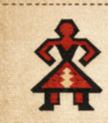
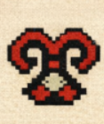
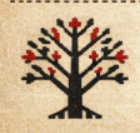
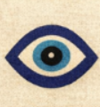
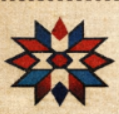
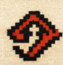
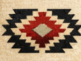
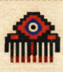
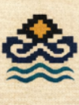
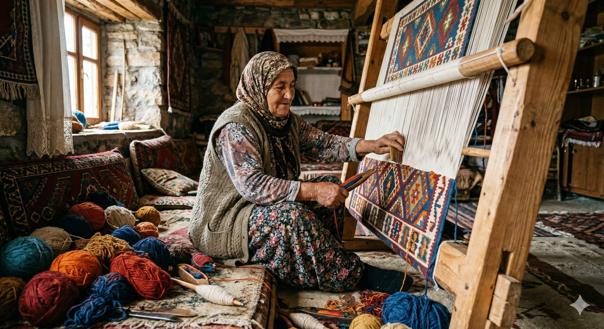

# 🎨 Kilim: The Ancient Geometry of the Soul

A Kilim is not just a rug; it is a **woven poem**. As the older ancestor of the knotted carpet, the Kilim has been the portable canvas of nomadic tribes for over 9,000 years.

---

## 🧿 The Silent Language: Kilim Motifs
Every diamond, triangle, and zigzag on a Kilim is a letter in an ancient alphabet. These designs were born from the **Shamanistic beliefs** of early Turkic tribes.

<!-- YENİ DÜZENLİ MOTİF ALANI BAŞLANGICI -->

  <!-- Satır 1: Elibelinde & Koçboynuzu -->
  

    

      <h3>ELIBELINDE (Hands on Hips)</h3>
      
Symbol of Fertility, Motherhood, and Womanhood.

    

    

      
    

    

      
    

    

      <h3>THE RAM'S HORN</h3>
      
Represents Strength, Power, and Heroism.

    

  

  <!-- Satır 2: Hayat Ağacı & Nazar -->
  

    

      <h3>TREE OF LIFE</h3>
      
Sign of Eternity, Growth, and Connection between Earth and Heaven.

    

    

      
    

    

      
    

    

      <h3>EVIL EYE</h3>
      
Protection from the Evil Eye and Negative Energies.

    

  

  <!-- Satır 3: Yıldız & Pıtrak -->
  

    

      <h3>STAR</h3>
      
Symbol of Good Luck and Spirituality.

    

    

      
    

    

      
    

    

      <h3>BURDOK (Hook)</h3>
      
Used as a Talisman against Evil and Danger.

    

  

  <!-- Satır 4: Kurt Ağzı & Bereket -->
  

    

      <h3>WOLF'S MOUTH</h3>
      
Symbolizes Protection and Bravery.

    

    

      
    

    

      
    

    

      <h3>FERTILITY (Evil Eye & Comb)</h3>
      
Represents Fertility and Abundance.

    

  

  <!-- Satır 5: Kurt Ağzı 2 & Su Yolu -->
  

    

      <h3>WOLF'S MOUTH</h3>
      
Symbolizes Protection and Bravery.

    

    

      
    

    

      
    

    

      <h3>WATER MOTIF</h3>
      
Symbol of Purity, Life, and Cleansing.

    

  

<!-- YENİ DÜZENLİ MOTİF ALANI BİTİŞİ -->

---

<!-- MOTİF ANALİZ ÖRNEĞİ BÖLÜMÜ -->

  <h2 style="color: #8b0000; margin-top: 0;">🔍 Case Study: Detailed Motif Analysis</h2>
  
To truly understand a kilim, we must look at how individual symbols come together. Below is a technical breakdown of a central medallion and its protective layers.

  <table border="0" style="width:100%; border-collapse: collapse;">
    <tr>
      <td style="text-align: center;">
        <!-- Tıklayınca büyüyen resim -->
        
         
        <em style="font-size: 13px; color: #666;">(Click the image to enlarge the technical details)</em>
      </td>
    </tr>
    <tr>
      <td style="padding-top: 20px; font-family: 'Georgia', serif; line-height: 1.6;">
        <h3>Key Takeaways from this Analysis:</h3>
        <ul>
          <li><strong>Layered Meaning:</strong> Notice how the <b>Wolf’s Mouth (Kurt İzi)</b> creates a jagged protective barrier around the inner elements.</li>
          <li><strong>The Core:</strong> The <b>Baklava (Diamond)</b> isn't just a shape; it's the "secure dwelling" or the heart of the home.</li>
          <li><strong>Spiritual Shield:</strong> By placing the <b>Pıtrak (Burdock)</b> at the very center (Step 4), the weaver ensures that abundance is protected by the "Eye" from any external harm.</li>
        </ul>
        
<i>As an expert curator, I recommend paying close attention to these "stepped" (Basamak) borders; they often tell the story of the weaver's family boundaries.</i>

      </td>
    </tr>
  </table>

## 🏛️ A Heritage Older Than History
The origins of Kilim symbols reach back to the **Neolithic era** (approx. 7000 BC). Unlike city rugs, Kilims represent the raw, honest, and poetic soul of the Anatolian plateau.

### 🏔️ Born from the Nomadic Spirit
*   **The Mountain Companion:** Kilims were lighter and easier to fold, making them perfect for high-altitude nomadic migration.
*   **The Reversible Masterpiece:** Most Kilims are **reversible**. There is no "back side"; both sides are equally beautiful, doubling the life of the art in your home.

---

## 👩‍🎨 The Master at Work: The Loom
A Kilim is created on a traditional wooden loom called a **"Tezgah."** There are no digital blueprints; the weaver translates ancestral patterns directly from her mind to her fingers.

  
  
<i>The weaver using the "Kirkit" (heavy comb) to beat the threads into a lifetime of durability.</i>

---

## 💃 The Iconic "Eli Belinde" (Hands on Hips)
This is the most important human motif in Anatolian weaving. It represents motherhood, fertility, and the **"Great Mother"** goddess.

  
  
<b>The Motherhood Symbol:</b> <i>A 9,000-year-old celebration of feminine power and creation.</i>

---

## 🌸 The Silent Voice: The Dowry (Çeyiz)
For centuries, weaving was the only way for a young woman to express her emotions. Every Kilim was a part of her **dowry**.

  
  
<i>A young weaver preparing her dowry—every thread carries a dream of a new life.</i>

---

## 🌿 The Alchemy of Nature: 100% Handmade
Every authentic Kilim is a product of immense patience:
1.  **Hand-Spun Wool:** Sheared from local sheep and spun by hand, creating a unique texture.
2.  **Vegetal Dyes:** Madder root for reds, Indigo for blues, and Saffron for yellows. These natural dyes age gracefully, gaining a beautiful "patina" over time.

---

## ⚠️ A Vanishing Art: Why Your Choice Matters
Hand-weaving is a vanishing art. When you acquire a hand-woven Kilim, you are acting as a **patron of the arts**. You are helping this ancient tradition survive for another generation.

---

### 🔍 Explore More
*   🌸 **[Detailed Guide: Cicim (Jijim) Technique](./cicim.md)**
*   🏺 **[Back to English Rug Guide](./guide.md)**
*   🏠 **[Global Home Page](../README.md)**