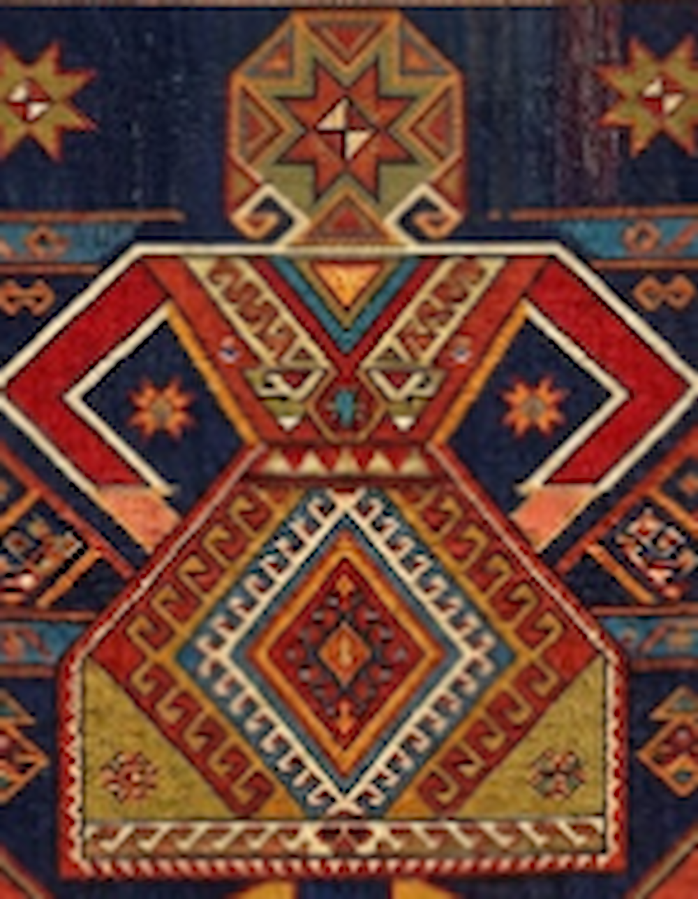
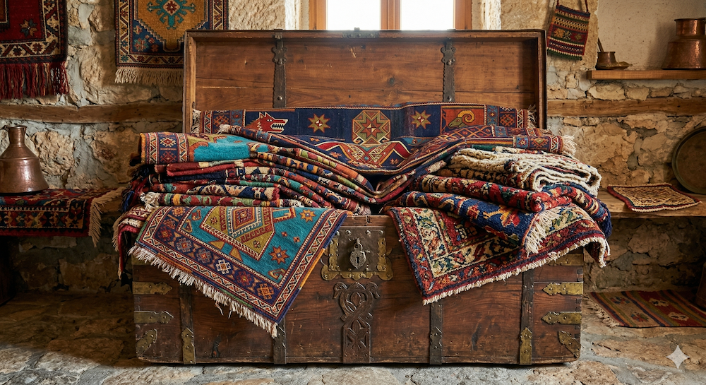

# 🎨 Kilim: The Ancient Geometry of the Soul

A Kilim is not just a rug; it is a **woven poem**. As the older ancestor of the knotted carpet, the Kilim has been the portable canvas of nomadic tribes for over 9,000 years.

---

## 🧿 The Silent Language: Kilim Motifs
Every diamond, triangle, and zigzag on a Kilim is a letter in an ancient alphabet. These designs were born from the **Shamanistic beliefs** of early Turkic tribes.

  
  
🔍 <i>Click to enlarge / Büyütmek için tıklayın</i>

---

## 🏛️ A Heritage Older Than History
The origins of Kilim symbols reach back to the **Neolithic era** (approx. 7000 BC). Unlike city rugs, Kilims represent the raw, honest, and poetic soul of the Anatolian plateau.

### 🏔️ Born from the Nomadic Spirit
*   **The Mountain Companion:** Kilims were lighter and easier to fold, making them perfect for high-altitude nomadic migration.
*   **The Reversible Masterpiece:** Most Kilims are **reversible**. There is no "back side"; both sides are equally beautiful, doubling the life of the art in your home.

---

## 👩‍🎨 The Master at Work: The Loom
A Kilim is created on a traditional wooden loom called a **"Tezgah."** There are no digital blueprints; the weaver translates ancestral patterns directly from her mind to her fingers.

  
  
<i>The weaver using the "Kirkit" (heavy comb) to beat the threads into a lifetime of durability.</i>

---

## 💃 The Iconic "Eli Belinde" (Hands on Hips)
This is the most important human motif in Anatolian weaving. It represents motherhood, fertility, and the **"Great Mother"** goddess.

  
  
<b>The Motherhood Symbol:</b> <i>A 9,000-year-old celebration of feminine power and creation.</i>

---

## 🌸 The Silent Voice: The Dowry (Çeyiz)
For centuries, weaving was the only way for a young woman to express her emotions. Every Kilim was a part of her **dowry**.

  
  
<i>A young weaver preparing her dowry—every thread carries a dream of a new life.</i>

---

## 🌿 The Alchemy of Nature: 100% Handmade
Every authentic Kilim is a product of immense patience:
1.  **Hand-Spun Wool:** Sheared from local sheep and spun by hand, creating a unique texture.
2.  **Vegetal Dyes:** Madder root for reds, Indigo for blues, and Saffron for yellows. These natural dyes age gracefully, gaining a beautiful "patina" over time.

---

## ⚠️ A Vanishing Art: Why Your Choice Matters
Hand-weaving is a vanishing art. When you acquire a hand-woven Kilim, you are acting as a **patron of the arts**. You are helping this ancient tradition survive for another generation.

---

### 🔍 Explore More
*   🌸 **[Detailed Guide: Cicim (Jijim) Technique](./cicim.md)**
*   🏺 **[Back to English Rug Guide](./guide.md)**
*   🏠 **[Global Home Page](../README.md)**
