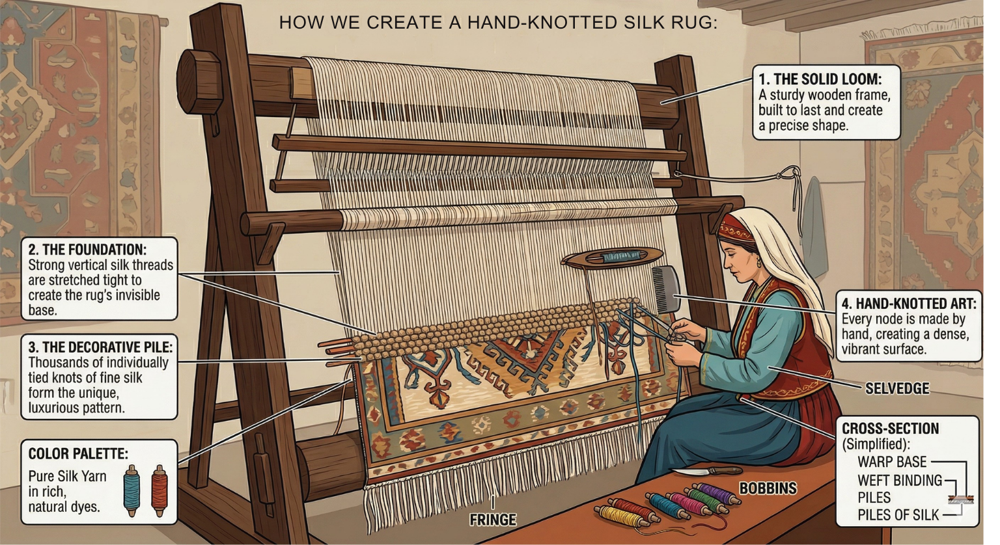

# Technical Analysis: The Materials of Fine Carpets

The quality of a hand-knotted carpet is fundamentally determined by the fibers used and the precision of the knots.

<!-- SECTION 1: WOOL JOURNEY -->
<table border="0" style="width:100%; margin-bottom: 30px; background-color: #fdf5e6; padding: 20px; border-radius: 10px;">
  <tr>
    <td style="vertical-align: top;">
      <h2 style="color: #8b0000; margin-top: 0;">1. The Journey of Wool (Yünün Yolculuğu)</h2>
      
Wool is the most traditional material in Anatolian weaving. High-quality wool is resilient, durable, and holds natural dyes perfectly. The process involves cleaning, carding, spinning by hand, and dyeing with natural roots.

      
      
The traditional preparation of wool from sheep to yarn.

    </td>
  </tr>
</table>

<!-- SECTION 2: SILK WEAVING -->
<table border="0" style="width:100%; margin-bottom: 30px; background-color: #fcfcfc; padding: 20px; border-radius: 10px; border: 1px solid #eee;">
  <tr>
    <td style="vertical-align: top;">
      <h2 style="color: #1a2a6c; margin-top: 0;">2. The Art of Silk Weaving (İpek Dokuma)</h2>
      
Silk is the most luxurious fiber, allowing weavers to achieve extreme knot density (often over 1 million knots per sqm). Silk carpets are prized for their shimmering luster and surgical precision in patterns, most notably seen in Hereke masterpieces.

      
    </td>
  </tr>
</table>

<!-- SECTION 3: KNOT COMPARISON -->
<table border="0" style="width:100%; margin-bottom: 30px; background-color: #f9f9f9; padding: 20px; border-radius: 10px;">
  <tr>
    <td style="vertical-align: top;">
      <h2 style="color: #2c3e50; margin-top: 0;">3. Knot Structure: The Foundation</h2>
      
The strength of a rug lies in its knots. The <strong>Turkish (Ghiordes) Double Knot</strong> is the hallmark of Anatolian carpets, providing superior durability compared to the single knot technique.

      
      
Visual comparison between different knotting techniques.

    </td>
  </tr>
</table>

  <a href="./handknotted" style="font-weight: bold; color: #8b0000; text-decoration: none;">🔍 View Regional Weaving Styles (Uşak & Bergama)</a>

