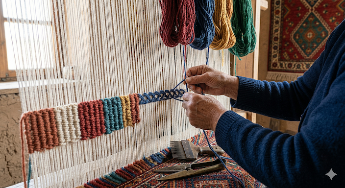

# 🌀 Regional Varieties of Sumak

Anatolia is a vast geography, and every region has developed its own signature Sumak style. Understanding these variations is the mark of a true connoisseur.

  
  
<i>"From Gaziantep to Adana: Four distinct souls of the Anatolian Sumak."</i>

### 1. Çapraz Sumak (Gaziantep Style) 🍷
*   **Technique:** "Çapraz" means **diagonal**. The weaver wraps the threads at an angle, creating a very strong, interlocking structure.
*   **Aura:** Usually features deep burgundy and navy tones with bold central diamonds.
*   **Best For:** High-traffic areas where extreme durability is required.

### 2. Düz Sumak (Niğde Style) 🏺
*   **Technique:** "Düz" means **straight/flat**. The wrapping follows horizontal bands, creating a very clean and organized look.
*   **Aura:** Focuses on classic Anatolian tribal symbols on earthy red and cream foundations.
*   **Best For:** Traditional interiors and lovers of rustic, tribal aesthetics.

### 3. Karma Sumak (Konya Style) 💎
*   **Technique:** "Karma" means **mixed or hybrid**. This style combines the fine detail of city rugs with the soul of nomadic geometry.
*   **Aura:** Known for intricate internal patterns within the diamonds and a rich use of turquoise and indigo.
*   **Best For:** Collectors looking for a "bridge" between tribal and sophisticated art.

### 4. Nakışlı Sumak (Adana/Cilician Style) 🌸
*   **Technique:** "Nakışlı" means **embroidered**. This is the most artistic form of Sumak, where the rug looks like a detailed needlepoint painting.
*   **Aura:** Features the **"Tree of Life,"** birds, and floral motifs. It is the most delicate and pictorial of all.
*   **Best For:** Wall hangings or centerpiece decor in elegant, art-focused rooms.
# 🪢 Understanding the Sumak Texture: A Close-Up Analysis

Watching the weaver's hands is the only way to truly understand why a Sumak is superior in strength and detail.

  
  
<i>"The Anatomy of a Wrap: Every single thread is hand-braided around the foundation."</i>

### 🔍 Technical Breakdown of this Image:

1. **The 360-Degree Wrap (Zincirleme):** 
In the photo, you can see the blue yarn being wrapped *around* the vertical warp threads. Unlike a regular Kilim where threads simply pass over and under, the Sumak weaver "loops" the yarn completely. This creates the famous **"Chain-Stitch"** effect you see in the finished rows.

2. **The Ribbed Texture:**
Notice the rows already completed (red, ochre, green). Each row looks like a tiny, strong rope. This is what gives Sumak its **extraordinary thickness and durability**. It is literally a "carpet without a pile" but with the strength of a heavy-duty fabric.

3. **The Kirkit (Heavy Comb):**
Look at the iron comb sitting on the loom. This is the **Kirkit**. After every wrap, the weaver uses this heavy tool to beat the threads down. This ensures the weave is so tight that it becomes nearly waterproof and lasts for centuries.

4. **Natural Tension:**
The weaver's fingers must maintain a constant, perfect tension. If one wrap is looser than the other, the pattern will shift. This is where the **mastery of the Anatolian woman** shines—she uses her muscle memory to create perfect geometric symmetry without any mechanical assistance.

> **Expert Insight:** "When you touch a Sumak, you are not just touching wool; you are touching a structure of thousands of interconnected loops. It is the most engineered form of nomadic textile art."

---
---
