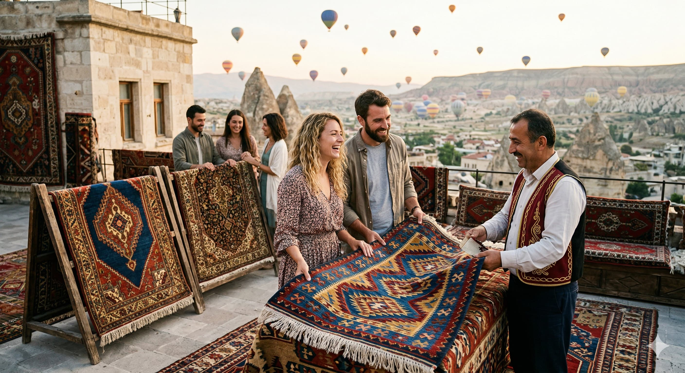

<a href="/carpetguide/cappodoce/#interactive-map">Click for Interactive Map</a> style="background: #8b0000; color: white !important; padding: 12px 20px; border-radius: 50px; text-decoration: none; font-weight: bold;">
    📍 Go to Interactive Map
</a>
<!-- Mobil Uyumluluk İçin Küçük Bir Stil Dokunuşu -->

<!-- ÜST BÖLÜM: MİZANPAJ -->

    <!-- SOL: Metinler -->
    

      <h1 style="font-size: 22px; color: #2c3e50; line-height: 1.1; margin: 0;">🧶 Global Carpet & Kilim Guide</h1>
      
<strong>Fatih Mehmet Canıtez</strong>

      
French Language Educator & Expert Curator

       
      <a href="./me" style="display: inline-block; padding: 6px 12px; background-color: #8b0000; color: white !important; text-decoration: none; border-radius: 5px; font-size: 12px; font-weight: bold;">👤 View Profile</a>
    

    <!-- ORTA: Tezgah (loom.jpg) -->
    

      
    

    <!-- SAĞ: Profil (carpet.jpeg) -->
    

      
   

<!-- KAPADOKYA MANZARA -->

  

<!-- LİNK BÖLÜMÜ 1: TARİHİ VE TEKNİK REHBERLER -->
<h3 style="text-align: center; color: #8b0000; font-family: 'Georgia', serif;">🏛️ Historical & Technical Deep-Dives</h3>
<table border="0" style="width:100%; text-align: center; table-layout: fixed;">
  <tr>
    <td style="padding:10px;">
      <a href="./en/hereke" style="text-decoration:none; color:#8b0000; font-weight:bold;">🏰 Imperial Hereke</a>
    </td>
    <td style="padding:10px;">
      <!-- Pazyryk detayları en/README.md içinde olduğu için direkt /en/ klasörüne gider -->
      <a href="./en/" style="text-decoration:none; color:#8b0000; font-weight:bold;">🏺 Pazyryk Analysis</a>
    </td>
    <td style="padding:10px;">
      <a href="./en/handknotted" style="text-decoration:none; color:#8b0000; font-weight:bold;">🌍 Carpet World</a>
    </td>
    <td style="padding:10px;">
      <!-- Yeni görsellerin olduğu sayfa -->
      <a href="./en/materials" style="text-decoration:none; color:#8b0000; font-weight:bold;">📊 Materials & Techniques</a>
    </td>
  </tr>
</table>

  <a href="./Cappodoce" style="font-size: 1.5em; font-weight: bold; color: #8b0000; text-decoration: none; border: 2px solid #8b0000; padding: 10px 20px; border-radius: 10px;">
    🌄 Explore My Cappadocia Guide (Insider Tips)
  </a>

<!-- LİNK BÖLÜMÜ 2: KİLİM VE DOKUMA TÜRLERİ -->
<h3 style="text-align: center; color: #2e8b57; margin-top: 20px; font-family: 'Georgia', serif;">📐 Kilim & Flat-Weave Masterpieces</h3>
<table border="0" style="width:100%; text-align: center; table-layout: fixed;">
  <tr>
    <td style="padding:10px;"><a href="./en/kilim" style="text-decoration:none; color:#2e8b57; font-weight:bold;">📐 Kilim Guide</a></td>
    <td style="padding:10px;"><a href="./en/cicim" style="text-decoration:none; color:#2e8b57; font-weight:bold;">🌸 Cicim Style</a></td>
    <td style="padding:10px;"><a href="./en/sumak" style="text-decoration:none; color:#2e8b57; font-weight:bold;">🌀 Sumak Tech</a></td>
    <td style="padding:10px;"><a href="./en/zili" style="text-decoration:none; color:#2e8b57; font-weight:bold;">🏗️ Zili Tech</a></td>
  </tr>
</table>

    <a href="/cappodoce/#map" style="background: #8b0000; color: white !important; padding: 15px 30px; border-radius: 50px; text-decoration: none; font-weight: bold; font-size: 18px; box-shadow: 0 4px 15px rgba(139,0,0,0.3); display: inline-block;">
        🗺️ Click for Interactive Map
    </a>

  <a href="./me" style="color: #7f8c8d; font-size: 14px; text-decoration: none; border: 1px dashed #ccc; padding: 5px 15px; border-radius: 20px;">👤 Curator Profile & French Lessons</a>

    <a href="/cappodoce/#map" style="background: #8b0000; color: white !important; padding: 15px 30px; border-radius: 50px; text-decoration: none; font-weight: bold; font-size: 18px; box-shadow: 0 4px 15px rgba(139,0,0,0.3); display: inline-block;">
        🗺️ Click for Interactive Map
    </a>

