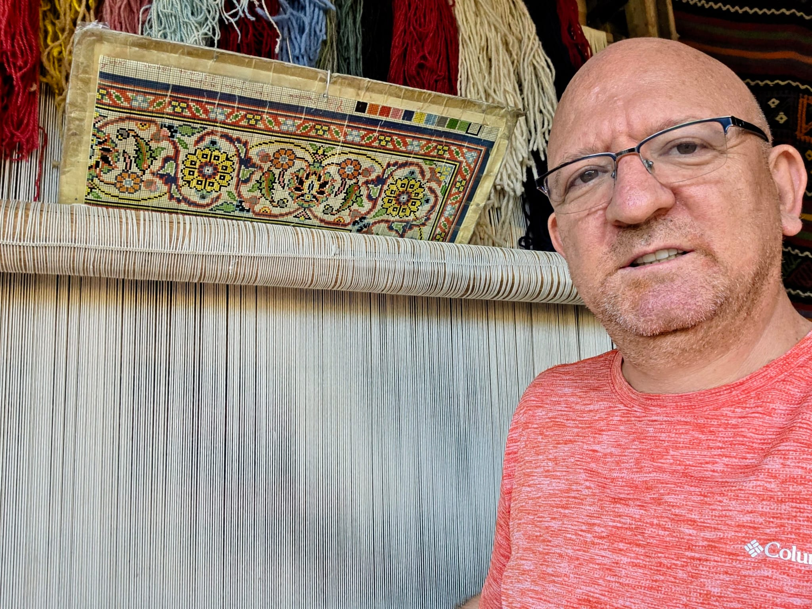
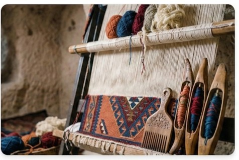

  <a href="./gallery" style="background: #8b0000; color: white !important; padding: 15px 30px; border-radius: 50px; text-decoration: none; font-weight: bold; font-size: 1.2em; box-shadow: 0 5px 15px rgba(139,0,0,0.3);">
    📸 View My Personal Photo Gallery
  </a>

<meta name="viewport" content="width=device-width, initial-scale=1.0, maximum-scale=1.0">

<!-- ════════════════════════════════════════════════════════ -->
<!--  HERO                                                    -->
<!-- ════════════════════════════════════════════════════════ -->

    

        
        

            <h1>
                🧶 Global Carpet &amp; Kilim Guide
                by Fatih Mehmet Canıtez
            </h1>
            
French Language Educator · Expert Curator · 50 years living and studying the carpets, valleys, and culture of Cappadocia.

            

                <a href="./me" class="btn-gold">👤 Curator Profile</a>
                <a href="./Cappodoce" class="btn-outline">🌄 Cappadocia Guide</a>
            

        

    

<!-- ════════════════════════════════════════════════════════ -->
<!--  LOOM IMAGE                                              -->
<!-- ════════════════════════════════════════════════════════ -->

    

<!-- HISTORY SHORTCUT - ELEGANT MINI CARD -->

  <a href="{{ site.baseurl }}/history-carpet" style="display: inline-flex; align-items: center; background: #fffcf5; border: 1px solid #d4af37; padding: 10px 20px; border-radius: 50px; text-decoration: none; transition: 0.3s; box-shadow: 0 4px 15px rgba(212, 175, 55, 0.1); max-width: 280px;">
    
    <!-- Simge: Antik bir mühür veya parşömen hissi -->
    🏛️
    
    

      
Carpet History

      
From Pazyryk to Palaces

    

    <!-- Küçük Ok Simgesi -->
    ➔
  </a>

<!-- ════════════════════════════════════════════════════════ -->
<!--  CAPPADOCIA FEATURED                                     -->
<!-- ════════════════════════════════════════════════════════ -->

    

        <h3>🌄 My Cappadocia Insider Guide</h3>
        
50 years of walking these valleys, visiting workshops, and building genuine friendships. Interactive map, VIP contacts, balloon tips, and a personal letter — in 7 languages.

        

            <a href="/carpetguide/Cappodoce.html#interactive-map" class="btn-featured-primary">🗺️ Open Interactive Map</a>
            <a href="./Cappodoce" class="btn-featured-outline">📖 Full Guide</a>
        

    

<!-- ════════════════════════════════════════════════════════ -->
<!--  HISTORICAL & TECHNICAL                                  -->
<!-- ════════════════════════════════════════════════════════ -->

    

    <h2>🏛️ Historical &amp; Technical Deep-Dives</h2>
    
From imperial looms to ancient techniques — the academic side of the craft

    <a href="./en/hereke" class="card">
        
🏰

        
Imperial Hereke

        
The finest silk carpets ever woven — made for Ottoman palaces.

        
Explore →

    </a>
    <a href="./en/" class="card">
        
🏺

        
Pazyryk Analysis

        
The world's oldest surviving carpet. 2,500 years old.

        
Explore →

    </a>
    <a href="./en/handknotted" class="card">
        
🌍

        
Carpet World

        
Hand-knotted traditions from Persia, Anatolia, Central Asia.

        
Explore →

    </a>
    <a href="./materials" class="card">
        
📊

        
Materials &amp; Techniques

        
Wool, silk, dyes, knot types and density explained.

        
Explore →

    </a>
    <a href="./carpet-map" class="card">
        
🗺️

        
Regional Map

        
20 weaving regions on an interactive map — Hereke to Kars.

        
Explore →

    </a>

<!-- INTERACTIVE TECHNICAL GUIDE SECTION -->

  <h3 style="color: #2e8b57; margin-top: 0; font-family: 'Georgia', serif;">🌍 Master the Art of Weaving</h3>
  
Explore our detailed analysis of ancient methods.

  <a href="./flat-viewing" style="...">🔍 Interactive Kilim & Double Knot Techniques</a>
 

<!-- ════════════════════════════════════════════════════════ -->
<!--  KILIM & FLAT-WEAVE                                      -->
<!-- ════════════════════════════════════════════════════════ -->

    

    <h2>📐 Kilim &amp; Flat-Weave Masterpieces</h2>
    
The woven language of Anatolia — symbols, structure, and soul

    <a href="./en/kilim" class="card green">
        
📐

        
Kilim Guide

        
Anatolian flat-weave — regions, motifs, how to read them.

        
Explore →

    </a>
    <a href="./en/cicim" class="card green">
        
🌸

        
Cicim Style

        
Embroidery on kilim — a delicate supplementary weft technique.

        
Explore →

    </a>
    <a href="./en/sumak" class="card green">
        
🌀

        
Sumak Technique

        
Wrap-weave without knots — dense, reversible, complex.

        
Explore →

    </a>
    <a href="./en/zili" class="card green">
        
🏗️

        
Zili Technique

        
Bold geometric float-weave of the Caucasus.

        
Explore →

    </a>

<!-- ════════════════════════════════════════════════════════ -->
<!--  CARE & MAINTENANCE                                       -->
<!-- ════════════════════════════════════════════════════════ -->

    

    <h2>🧹 Care &amp; Maintenance</h2>
    
Keep your carpet beautiful for generations to come

    <a href="./carpet-map" style="display: flex; align-items: center; gap: 20px; padding: 22px 24px; border-radius: 16px; background: linear-gradient(120deg, #f0f4ff, #e8eeff); border: 1px solid #1a2a6c; box-shadow: 0 4px 15px rgba(26,42,108,0.12); text-decoration: none; color: inherit;">
        
🗺️

        

            
Turkey Carpet &amp; Kilim Map

            
Interactive map of 20 weaving regions — Hereke, Yağcıbedir, Döşemealtı, Kars, Niğde and more. Click any marker for details.

        

        
→

    </a>

<a href="./carpet-sizes" style="display: flex; align-items: center; gap: 20px; padding: 22px 24px; border-radius: 16px; background: linear-gradient(120deg, #f0fff4, #e8f5e8); border: 1px solid #2e8b57; box-shadow: 0 4px 15px rgba(46,139,87,0.12); text-decoration: none; color: inherit;">
        
📐

        

            
Carpet Size Guide

            
Interactive room planner — 9 standard sizes in cm &amp; inches, with furniture layout.

        

        
→

    </a>
    
    <a href="./cleaning" style="display: flex; align-items: center; gap: 20px; padding: 22px 24px; border-radius: 16px; background: linear-gradient(120deg, #fffbf0, #fdf5e6); border: 1px solid #d4af37; box-shadow: 0 4px 15px rgba(212,175,55,0.15); text-decoration: none; color: inherit;">
        
🧹

        

            
Carpet &amp; Kilim Care Guide

            
Stain emergencies, daily care, storage, silk vs wool vs kilim — everything you need to protect your investment.

        

        
→

    </a>

<!-- ════════════════════════════════════════════════════════ -->
<!--  FOOTER                                                  -->
<!-- ════════════════════════════════════════════════════════ -->

    

        <strong>Fatih Mehmet Canıtez</strong>
        French Language Educator · Expert Carpet Curator · Göreme, Cappadocia
    

    <a href="./me" class="footer-profile">👤 Curator Profile &amp; French Lessons →</a>

<!-- SLOW-MOTION & INTERACTIVE VIDEO POPUP -->

  
  

    
    <!-- KAPATMA BUTONU (Üst Sağ) -->
    <button onclick="closeVideo()" style="position: absolute; top: 15px; right: 15px; background: rgba(0,0,0,0.5); color: #fff; border: none; border-radius: 50%; width: 35px; height: 35px; font-size: 18px; cursor: pointer; z-index: 11; display: flex; align-items: center; justify-content: center;">✕</button>

    <!-- VİDEO ALANI (Üstüne tıklayınca durur/başlar) -->
    

      <video id="localVideo" width="100%" height="auto" autoplay muted loop playsinline style="display: block;">
        <source src="{{ site.baseurl }}/images/ghiordes-knot.mp4" type="video/mp4">
      </video>
      
      <!-- SES AÇ/KAPA BUTONU (Videonun sol alt köşesinde yüzer buton) -->
      <button id="muteBtn" onclick="toggleMute(event)" style="position: absolute; bottom: 15px; left: 15px; background: rgba(0,0,0,0.6); border: none; color: white; padding: 8px; border-radius: 50%; width: 35px; height: 35px; cursor: pointer; z-index: 12;">
        🔇
      </button>

      <!-- ORTADA ÇIKAN OYNAT SİMGESİ (Sadece durunca görünür) -->
      
▶️

    

    <!-- BİLGİ ALANI -->
    

      <h3 style="margin: 0; font-size: 14px; color: #8b4513; letter-spacing: 1px;">SLOW MOTION ANALYSIS</h3>
      
Tap video to Pause/Play

    

  

<!DOCTYPE html>
<html lang="en">
<head>
  <meta charset="UTF-8">
  <meta name="viewport" content="width=device-width, initial-scale=1.0">
  <title>RugVision — See It Before You Buy It</title>
  <link href="https://fonts.googleapis.com/css2?family=Cormorant+Garamond:wght@300;400;600&family=DM+Sans:wght@300;400;500&display=swap" rel="stylesheet">
  
</head>
<body>

<!-- ═══════════ LANDING PAGE ═══════════ -->

  <!-- Nav -->
  <nav>
    <a class="logo" href="#">RUGVISION</a>
    <a href="studio.html" class="nav-cta" style="text-decoration:none;">Try Free Now</a>
  </nav>

  <!-- Hero -->
  <section class="hero">
    

    

      
AI-Powered Rug Visualizer

      <h1 class="hero-title">See Your Rug in <em>Any Room</em></h1>
      
Upload your product photo, pick a room, and watch it come to life — before a single order is placed.

    

    <!-- Video Player -->
    

      

        

          

            

            

          

        

        

          <svg viewBox="0 0 24 24"><path d="M8 5v14l11-7z"/></svg>
        

        
RugVision Studio — Demo

      

      <!-- Video controls (decorative) -->
      

        <button class="vb-btn">▶</button>
        

          

        

        0:00 / 2:34
        <button class="vb-btn">🔊</button>
        <button class="vb-btn">⛶</button>
      

    

    <!-- Popup trigger strip — directly under video -->
    

      

        <strong>Ready to visualize your own rug?</strong> 
        Upload a product photo and see it in a real room in seconds.
      

      <a href="studio.html" class="strip-cta" style="text-decoration:none;">
        <svg viewBox="0 0 24 24"><path d="M14 2H6c-1.1 0-2 .9-2 2v16c0 1.1.9 2 2 2h12c1.1 0 2-.9 2-2V8l-6-6zm-1 7V3.5L18.5 9H13z"/></svg>
        Upload Your Rug
      </a>
    

  </section>

  <!-- Marquee -->
  

    

      
✦ AI Room Generator

      
✦ Real-Time Perspective Fit

      
✦ Runner &amp; Area Rug Modes

      
✦ Drag &amp; Drop Placement

      
✦ Multiple Room Types

      
✦ AI Room Generator

      
✦ Real-Time Perspective Fit

      
✦ Runner &amp; Area Rug Modes

      
✦ Drag &amp; Drop Placement

      
✦ Multiple Room Types

    

  

  <!-- Features -->
  <section class="features">
    

      
01

      
🖼

      <h3>AI Room Generation</h3>
      
Generate photorealistic rooms matching your style preferences — from luxury hallways to minimalist bedrooms.

    

    

      
02

      
📐

      <h3>Floor Perspective Fit</h3>
      
Smart tilt, scale and shadow controls let you lock your rug flat to the floor with pixel precision.

    

    

      
03

      
↕

      <h3>Runner Mode</h3>
      
Dedicated yolluk/runner mode automatically applies the correct narrow portrait aspect ratio for hallway rugs.

    

    

      
04

      
✦

      <h3>Instant &amp; Free</h3>
      
No login, no account. Upload, configure, visualize. Share the result with your customer in one click.

    

  </section>

<!-- /landing -->

<!-- ═══════════ UPLOAD POPUP ═══════════ -->

  

    

      <button class="popup-close" onclick="closePopup()" aria-label="Close">✕</button>
      
Step 1 of 2

      <h2>Upload Your Rug Photo</h2>
      
Choose a clear product image — transparent background works best, but any photo will do.

    

    

      <!-- Preview (hidden until file chosen) -->
      

        
        
Your Rug

        <button class="remove-btn" onclick="removeFile()" title="Remove">✕</button>
      

      <!-- Drop zone -->
      

        <input type="file" id="popup-file" accept="image/*" onchange="handlePopupFile(event)">
        

          <svg viewBox="0 0 24 24"><path d="M21 15v4a2 2 0 01-2 2H5a2 2 0 01-2-2v-4M17 8l-5-5-5 5M12 3v12"/></svg>
        

        <h4>Drop your rug image here</h4>
        
or click to browse files

        
JPG · PNG · WEBP · up to 20MB

      

      <button class="popup-launch" id="popup-launch-btn" disabled onclick="launchStudio()">
        <svg viewBox="0 0 24 24"><path d="M5 3l14 9-14 9V3z"/></svg>
        Open in Studio
      </button>

      
Your image is processed locally in the browser — never uploaded to any server.

    

  

<!-- ═══════════ STUDIO PAGE ═══════════ -->

  

    RUGVISION STUDIO
    <button class="studio-back" onclick="backToLanding()">← Back to Home</button>
  

  

    

      <h2>Studio Config</h2>

      

        <label>Room Type</label>
        <select id="roomType">
          <option value="luxury entrance hallway">Entrance Hallway</option>
          <option value="modern spacious living room" selected>Living Room</option>
          <option value="minimalist master bedroom">Bedroom</option>
          <option value="modern dining room">Dining Room</option>
        </select>
      

      

        <label>Furniture Color</label>
        <select id="sofaColor">
          <option value="Cream linen">Cream / Beige</option>
          <option value="Grey modern">Grey</option>
          <option value="Anthracite dark grey">Anthracite</option>
          <option value="Navy blue velvet">Navy Blue</option>
          <option value="Emerald green velvet">Emerald Green</option>
          <option value="Mustard yellow fabric">Mustard Yellow</option>
          <option value="Cognac leather">Cognac Leather</option>
          <option value="Terracotta warm">Terracotta</option>
          <option value="Pure white minimalist">White</option>
        </select>
      

      

        <label>Room Size</label>
        <select id="roomSize">
          <option value="15">Small — 15 m²</option>
          <option value="25" selected>Medium — 25 m²</option>
          <option value="40">Large — 40 m²</option>
          <option value="60">Very Large — 60 m²</option>
        </select>
      

      

        <label>Rug Type</label>
        

          <button class="mode-btn active" id="btn-normal" onclick="setRugMode('normal')">▪ Area Rug</button>
          <button class="mode-btn" id="btn-runner" onclick="setRugMode('runner')">▬ Runner</button>
        

      

      

        <label>Replace Rug Image</label>
        <input type="file" id="rugFile" accept="image/*" onchange="loadRug(event)">
      

      <button class="btn-main" onclick="generateRoom()">Generate AI Room</button>

      

        
Floor Placement Controls

        
Scale1.00

        <input type="range" id="scale" min="0.1" max="3.0" step="0.05" value="1" oninput="updateRug()">

        
Floor Tilt62°

        <input type="range" id="tilt" min="45" max="85" step="1" value="62" oninput="updateRug()">

        
Rotation0°

        <input type="range" id="rotate" min="-45" max="45" step="1" value="0" oninput="updateRug()">

        

          
Runner Length3.0×

          <input type="range" id="runnerLength" min="1.5" max="6" step="0.1" value="3" oninput="updateRug()">
        

        
Shadow50

        <input type="range" id="shadowStr" min="0" max="100" step="5" value="50" oninput="updateRug()">

        <button class="mode-btn" onclick="toggleGuide()" style="width:100%; margin-top:4px; font-size:11px;">
          Toggle Floor Guide
        </button>
      

    

    

      
Generating your room…

      

        
        

        

        
      

    

  

<!-- /studio-page -->

</body>
</html>

